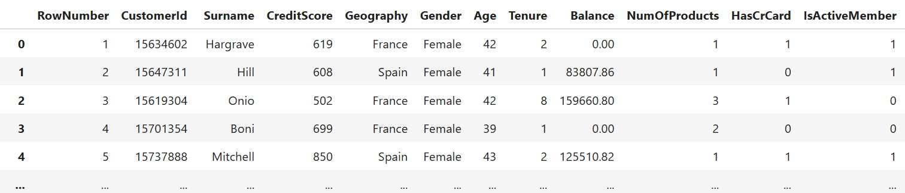
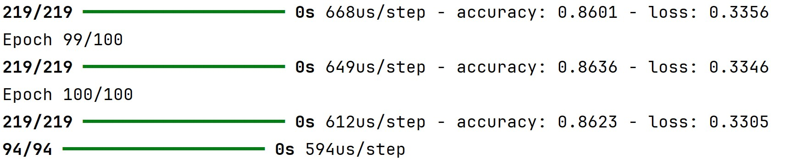

# דוגמה של בניית מודל ANN בפייתון

### קובץ הנתונים – Churn_Modelling.csv

מדובר בקובץ שמכיל מידע על לקוחות של בנק  
לכל שורה יש מידע כמו גיל מגדר מדינה אם יש לו כרטיס אשראי יתרה ועוד  
יש גם עמודה בשם `Exited` שאומרת אם הלקוח עזב את הבנק או נשאר  
המטרה שלנו היא לחזות בעזרת רשת נוירונים אם לקוח עתידי יעזוב את הבנק או לא



## שלב 1 – בניית קבוצות של נתונים

אנחנו מפרידים את הנתונים לשתי קבוצות עיקריות  
X זה כל הנתונים שמהם המודל ילמד  
y זו העמודה שאנחנו מנסים לחזות  
כמו כן אנחנו מוחקים עמודות מזהות שלא עוזרות ללמידה כמו מספר שורה ושם משפחה

```python
import pandas as pd

# Load the dataset
df = pd.read_csv('Churn_Modelling.csv')

# Drop the 'RowNumber' column as it's not needed
df = df.drop('RowNumber', axis=1)

# Display the first few rows
df.head()

# Create feature dataset (X) and target variable (y)
X = df.drop(['CustomerId', 'Surname', 'Exited'], axis=1)
y = df['Exited']
```

## שלב 2 – טיפול בעמודות קטגוריות

יש עמודות שמכילות טקסטים כמו מגדר או מדינה  
בשביל שמכונה תוכל להבין את זה אנחנו ממירים את הטקסטים למספרים  
זה נקרא One Hot Encoding – הופכים כל ערך בעמודה לעמודה חדשה עם ערכים 0 או 1

לדוגמה  
המגדר Male הופך לעמודה Gender_Male  
המדינות France Spain יהפכו לשתי עמודות נפרדות

```python
# Handle categorical variables using one-hot encoding
X = pd.get_dummies(X, columns=['Gender'], drop_first=True)  # Convert 'Gender' to numerical (Male=1, Female=0)
X = pd.get_dummies(X, columns=['Geography'], drop_first=False)  # Keep all categories for 'Geography'
```

## שלב 3 – פיצול ל־Train ו־Test

אנחנו מחלקים את הנתונים לשני חלקים  
Train זו הקבוצה שעליה המודל לומד  
Test זו הקבוצה שעליה בודקים את הביצועים של המודל

```python
# Import necessary libraries
from sklearn.model_selection import train_test_split
from sklearn.preprocessing import StandardScaler

# Split the dataset into training and testing sets (70% train, 30% test)
X_train, X_test, y_train, y_test = train_test_split(X, y, test_size=0.3, random_state=42)
```

## שלב 4 – סטנדרטיזציה

לפני שמתחילים לבנות את המודל עושים סטנדרטיזציה לנתונים  
כלומר ממירים את הערכים כך שיהיו בממוצע אפס וסטיית תקן אחת  
זה חשוב מאוד ברשתות נוירונים כדי לאזן את השפעת כל פיצ'ר

```python
# Initialize the StandardScaler
scaler = StandardScaler()

# Standardize the training and test sets
scaled_X_train = scaler.fit_transform(X_train)
scaled_X_test = scaler.transform(X_test)
```

**למה לא משתמשים ב־Min-Max ברשתות נוירונים**

**מה זה Min-Max Normalization**

שיטה שמביאה את כל הערכים של העמודות **לטווח קבוע**, לרוב בין 0 ל־1  
הנוסחה היא:

$$
x_{\text{normalized}} = \frac{x - \min}{\max - \min}
$$

**למה זה נשמע טוב**

- כל הערכים באותו טווח  
- מתאים מאוד למודלים שמבוססים על מרחקים כמו KNN או SVM  
- עובד יפה כשאין קיצוניים בנתונים

**אז למה זה פחות טוב לרשתות נוירונים**

**1. רגיש מאוד לערכים קיצוניים (Outliers)**

אם יש ערך אחד חריג בטירוף ה־min וה־max יזוזו חזק  
וכל שאר הנתונים יתכווצו ויהיו כמעט זהים רשתות נוירונים יתקשו ללמוד מהם

**2. אין מרכז סביב אפס**

רוב פונקציות ההפעלה כמו ReLU, Tanh או Sigmoid מגיבות **אחרת לערכים שליליים וחיוביים**  
סטנדרטיזציה (StandardScaler) מביאה את הנתונים לממוצע אפס וסטיית תקן 1  
זה עוזר מאוד לפונקציות ההפעלה ללמוד בצורה יציבה

**3. ה- Gradient Descent עובד טוב יותר סביב אפס**

ב־Min-Max הערכים תמיד חיוביים זה עלול לגרום ללמידה איטית או תקועה  
סטנדרטיזציה עוזרת לגרדיאנט לזוז יותר טוב בכיוונים חיוביים ושליליים

**אז מתי כן נשתמש ב־Min-Max**

- אם אנחנו בטוחים שאין ערכים קיצוניים בכלל  
- אם אנחנו עובדים עם רשתות פשוטות יחסית  
- אם אנחנו נדרשים לעבוד עם טווח של 0 עד 1 (למשל קלט של תמונות)  
- כשמשתמשים ב־Neural Networks בלי פונקציית הפעלה רגישות לאפס

**המלצה כללית**

ברשתות נוירונים מודרניות  
עדיף להשתמש ב־**StandardScaler** שמביא את הנתונים לממוצע 0 וסטיית תקן 1  
זה מתאים גם ל־SGD וגם לפונקציות הפעלה כמו ReLU ו־Tanh


## שלב 5 – בניית רשת הנוירונים ANN

הרשת מורכבת משכבות  
שכבת קלט מעבירה את המידע הגולמי  
שכבת חבויה מבצעת את הלמידה והחישובים  
שכבת פלט נותנת את התוצאה אם הלקוח יעזוב

במקרה הזה  
יש שכבת חבויה אחת עם עשרה נוירונים  
פונקציית ההפעלה שלה היא ReLU שמתאימה ללמידה כללית  
שכבת הפלט מכילה נוירון אחד עם פונקציית הפעלה Sigmoid שמתאימה לסיווג בינארי

```python
# Import necessary libraries
import tensorflow as tf
from tensorflow.keras.models import Sequential
from tensorflow.keras.layers import Dense

# Initialize the ANN model
ann = tf.keras.models.Sequential()

# First layer - Input + first hidden layer
ann.add(tf.keras.layers.Dense(units=10))

# Second layer - Hidden layer
ann.add(tf.keras.layers.Dense(units=10, activation='relu'))

# Third layer - Output layer
ann.add(tf.keras.layers.Dense(units=1, activation='sigmoid'))
```

## שלב 6 – קומפילציה של המודל

אנחנו צריכים להגדיר למודל שלושה דברים  
Optimizer זה האלגוריתם שמעדכן את המשקלים לדוגמה SGD  
Loss זו פונקציית הפסד שהמודל מנסה למזער לדוגמה binary_crossentropy  
Metrics אלו מדדים שבודקים את הביצועים של המודל לדוגמה accuracy

```python
# Compile the ANN model
ann.compile(optimizer='sgd', loss='binary_crossentropy', metrics=['accuracy'])
```

### מה זה binary_crossentropy

פונקציית הפסד (loss function)  
היא משמשת אותנו כשאנחנו פותרים **בעיה של סיווג בינארי**  
כלומר בעיה שבה יש רק שתי תשובות אפשריות דוגמה – האם לקוח יעזוב את הבנק או יישאר  
0 = לא עזב  
1 = כן עזב

**מה התפקיד של הפונקציה**

המטרה של הפונקציה היא למדוד כמה המודל טעה  
ככל שהטעות גדולה יותר – הערך של הפונקציה גבוה יותר  
המודל מנסה למזער את הפונקציה הזאת במהלך האימון

**איך זה עובד**

אם המודל חוזה שהסיכוי הוא 0.9 ובלמעשה זה באמת 1  
אז זה נחשב טוב  
אבל אם המודל חוזה 0.1 וזה בעצם צריך להיות 1  
אז זו טעות גדולה וה־loss יהיה גבוה

<a href="#formula">ראה נספח הסבר נוסחא</a>

## שלב 7 – אימון Training

המודל מתאמן על הנתונים למשך מספר איטרציות שנקראות epochs  
בכל איטרציה הוא מעדכן את המשקלים ומנסה לדייק יותר  
אנחנו בוחרים גם גודל חבילה batch_size כלומר כמה שורות יתעדכנו יחד בכל פעם  
במקרה הזה batch_size שווה ל־32 ו־epochs שווה ל־100

```python
# Train the ANN model
ann.fit(scaled_X_train, y_train, batch_size=32, epochs=100)
```



**מה זה 94/94 בשורת הפלט של המודל**

זה אומר שהמודל ביצע **94 צעדים (steps)** במהלך שלב ה־evaluation או ה־prediction  
כלומר הוא חילק את הנתונים ל־94 חבילות (batches)  
ועבר עליהן אחת אחת
כל חבילה בגודל 32
32 * 94 ~= 3000

**מה זה 219/219 בשורת הפלט של האימון**

המספר הזה מתאר **כמה צעדים (steps)** היו באותו epoch של האימון  
כלומר – בכמה חבילות (batches) המודל חילק את הנתונים של האימון  

אם יש לך למשל 7,000 דוגמאות באימון  
וה־batch_size הוא 32  

מכיוון ש 32 * 219 ~= 7000

## שלב 8 – חיזוי על טסט חדש

בסיום האימון בודקים איך המודל חוזה תוצאות על קבוצת הטסט  
הוא נותן ערכים בין אפס לאחת שמייצגים הסתברות  
כדי לקבל תשובה בינארית אמיתית קובעים סף לרוב 0.5  
אם הערך מעל זה נחשב לאחד אחרת זה אפס

```python
# Import necessary libraries
from sklearn.metrics import accuracy_score, confusion_matrix, classification_report

# Predict on the test set
y_pred = (ann.predict(scaled_X_test) > 0.5)

# Print evaluation metrics
print(accuracy_score(y_test, y_pred))
print(confusion_matrix(y_test, y_pred))
```

Output:
```
0.868

[[2334   82]
 [ 314  270]]
```

### ניתוח התוצאות של המודל

**דיוק כללי (Accuracy)**

```
0.868
```

המשמעות היא שהמודל חזה נכון ב־86.8% מהמקרים בקבוצת הטסט זהו מדד כללי לכמה אחוז מהתחזיות היו נכונות
זה נחשב דיוק טוב, אבל כדאי לבדוק גם מה קורה בתוך המספרים עצמם

**טבלת בלבול (Confusion Matrix)**

```
[[2334   82]
 [ 314  270]]
```

הטבלה מראה איך המודל ביצע בפועל – איפה הוא צדק ואיפה הוא טעה  
היא נראית כך:

|                      | Predicted 0 (Not Leaving) | Predicted 1 (Leaving) |
|----------------------|---------------------------|------------------------|
| Actual: 0 (Not Left) | 2334                      | 82                     |
| Actual: 1 (Left)     | 314                       | 270                    |


### הסבר של כל תא בטבלה

- **2334** – לקוחות שלא עזבו והמודל חזה נכון שלא יעזבו (True Negatives)  
- **270** – לקוחות שכן עזבו והמודל חזה נכון שיעזבו (True Positives)  
- **82** – לקוחות שלא עזבו אבל המודל חשב בטעות שכן (False Positives)  
- **314** – לקוחות שכן עזבו אבל המודל פספס וחשב שהם לא יעזבו (False Negatives)

הטבלה עוזרת להבין לא רק את הדיוק הכללי אלא גם איזה סוג של טעויות המודל עושה

## שלב 9 – חיזוי על לקוח חדש

אפשר להזין למודל גם לקוח חדש שמעולם לא ראה  
מכינים שורה עם ערכי הלקוח כמו גיל מגדר יתרה וכדומה  
עושים עליה סטנדרטיזציה באותו אופן שעשינו קודם  
מפעילים את המודל ומקבלים ניבוי אם הלקוח יעזוב או לא

```python
# Predicting on new customer data
new_customer_details = [[600, 40, 3, 60000, 2, 1, 1, 50000, 1, 1, 0, 0]]

# Scale the new data
scaled_customer_details = scaler.transform(new_customer_details)

# Predict whether the customer will exit (1) or stay (0)
print(ann.predict(scaled_customer_details) > 0.5)
```

Output:
```
[[False]]
```

---
## complete code

```python
import pandas as pd

# Load the dataset
df = pd.read_csv('Churn_Modelling.csv')

# Drop the 'RowNumber' column as it's not needed
df = df.drop('RowNumber', axis=1)

# Display the first few rows
df.head()

# Create feature dataset (X) and target variable (y)
X = df.drop(['CustomerId', 'Surname', 'Exited'], axis=1)
y = df['Exited']

# Handle categorical variables using one-hot encoding
X = pd.get_dummies(X, columns=['Gender'], drop_first=True)  # Convert 'Gender' to numerical (Male=1, Female=0)
X = pd.get_dummies(X, columns=['Geography'], drop_first=False)  # Keep all categories for 'Geography'
print(X.head())

# Import necessary libraries
from sklearn.model_selection import train_test_split
from sklearn.preprocessing import StandardScaler

# Split the dataset into training and testing sets (70% train, 30% test)
X_train, X_test, y_train, y_test = train_test_split(X, y, test_size=0.3, random_state=42)

# Initialize the StandardScaler
scaler = StandardScaler()

# Standardize the training and test sets
scaled_X_train = scaler.fit_transform(X_train)
scaled_X_test = scaler.transform(X_test)

# Import necessary libraries
import tensorflow as tf
from tensorflow.keras.models import Sequential
from tensorflow.keras.layers import Dense

# Initialize the ANN model
ann = tf.keras.models.Sequential()

# First layer - Input + first hidden layer
# shape of the input is (7000, 12)
ann.add(tf.keras.layers.Dense(units=10, activation='relu', input_shape=(12,)))

# Second layer - Hidden layer
ann.add(tf.keras.layers.Dense(units=10, activation='relu'))

# Third layer - Output layer
ann.add(tf.keras.layers.Dense(units=1, activation='sigmoid'))

# Compile the ANN model
ann.compile(optimizer='sgd', loss='binary_crossentropy', metrics=['accuracy'])

# Train the ANN model
ann.fit(scaled_X_train, y_train, batch_size=32, epochs=100)

# Import necessary libraries
from sklearn.metrics import accuracy_score, confusion_matrix, classification_report

# Predict on the test set
y_pred = (ann.predict(scaled_X_test) > 0.5)

# Print evaluation metrics
print(accuracy_score(y_test, y_pred))
print(confusion_matrix(y_test, y_pred))

# Predicting on new customer data
new_customer_details = [[600, 40, 3, 60000, 2, 1, 1, 50000, 1, 1, 0, 0]]

# Scale the new data
scaled_customer_details = scaler.transform(new_customer_details)

# Predict whether the customer will exit (1) or stay (0)
print(ann.predict(scaled_customer_details) > 0.5)
```

## נספח - binary_crossentropy 

<a id="formula">הסבר נוסחא</a>

$$
\text{Loss} = - \left[ y \cdot \log(\hat{y}) + (1 - y) \cdot \log(1 - \hat{y}) \right]
$$

- y זה הערך האמיתי (0 או 1)  
- y^ זה הניבוי של המודל (בין 0 ל־1)

**הצבה לדוגמה בתוך הנוסחה**

הנוסחה:

נניח:
- y = 1
- y^ = 0.9 

נבצע הצבה:

$$
\text{Loss} = - \left[ 1 \cdot \log(0.9) + (1 - 1) \cdot \log(1 - 0.9) \right]
$$

שזה יוצא:

$$
\text{Loss} = - \log(0.9) \approx -(-0.105) = 0.105
$$

ככל שהתוצאה קרובה ל־0, זה אומר שהמודל חזה טוב  
ככל שהתוצאה גדולה יותר, זה אומר שהמודל טעה יותר

**האם `binary_crossentropy` תמיד מחזירה ערכים בין 0 ל־1?**

לא  
`binary_crossentropy` **לא מוגבלת** לערכים בין 0 ל־1  
היא יכולה להחזיר גם ערכים גדולים מ־1  
ואפילו לפעמים גם ערכים מאוד גדולים (אם המודל מאוד טעה)

**למה דווקא זו הפונקציה המתאימה**

- היא מתאימה במיוחד כשמשתמשים ב־sigmoid בשכבת הפלט  
- היא יודעת להתייחס נכון לפלט שהוא הסתברות  
- היא מענישה ניבויים בטוחים אבל שגויים (כמו 0.01 כשהאמת היא 1)

**מתי משתמשים ב־binary_crossentropy**

- סיווג של דוא"ל כספאם או לא  
- חיזוי אם לקוח יעזוב  
- בדיקת אם משתמש ילחץ על פרסומת
