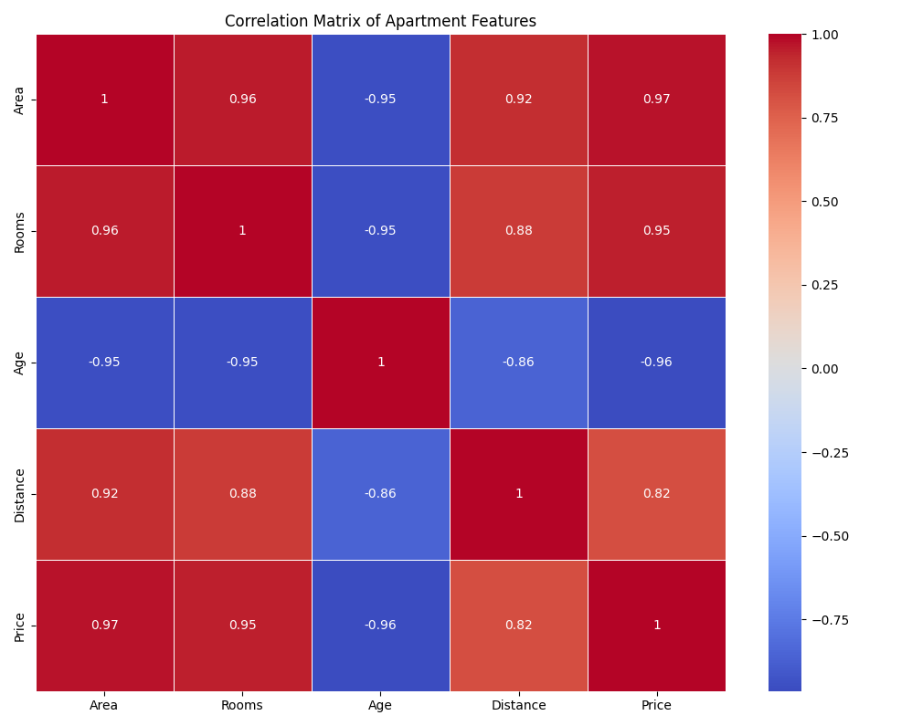

# רגרסיה לינארית מרובת משתנים עם Gradient Descent

## הבעיה שרוצים לפתור

רגרסיה לינארית מרובת משתנים (Multiple Linear Regression) מרחיבה את מודל הרגרסיה הלינארית הפשוטה ומאפשרת לנו לבחון את הקשר בין משתנה תלוי אחד ומספר משתנים בלתי תלויים. כך ניתן לבנות מודלים מורכבים יותר ולשפר את יכולת החיזוי.

**דוגמה**: נניח שאנו רוצים לחזות את מחיר הדירה בהתבסס על מספר מאפיינים. בניגוד לרגרסיה לינארית פשוטה, שעשויה להתייחס רק לשטח הדירה, רגרסיה מרובת משתנים מאפשרת לנו לשקלל גם גורמים נוספים כמו מספר חדרים, גיל המבנה, מיקום, וכדומה.

להלן דוגמה לנתונים של דירות:

| שטח (מ"ר) | מספר חדרים | גיל המבנה (שנים) | מרחק ממרכז העיר (ק"מ) | מחיר (אלפי ש"ח) |
|-----------|------------|-----------------|----------------------|-----------------|
| 70        | 3          | 15              | 5                    | 1,200           |
| 90        | 4          | 10              | 7                    | 1,500           |
| 60        | 2          | 20              | 3                    | 1,100           |
| 120       | 5          | 5               | 10                   | 1,800           |
| 80        | 3          | 12              | 6                    | 1,300           |
| 110       | 4          | 8               | 8                    | 1,650           |
| 100       | 4          | 7               | 5                    | 1,750           |
| 75        | 3          | 18              | 4                    | 1,250           |
| 95        | 4          | 9               | 6                    | 1,550           |
| 130       | 5          | 3               | 12                   | 1,900           |

המטרה שלנו היא לבנות מודל שיאפשר לנו לחזות את מחיר הדירה בהתבסס על המאפיינים השונים, ולהבין את ההשפעה היחסית של כל מאפיין על המחיר.

## רגרסיה לינארית מרובת משתנים עם Gradient Descent

בעוד שניתן לפתור רגרסיה לינארית מרובת משתנים באמצעות משוואות נורמליות (הפתרון האנליטי), שיטת **ירידת הגרדיאנט (Gradient Descent)** מציעה אלטרנטיבה יעילה, במיוחד עבור מערכות נתונים גדולות.

## Mathematical Formula and Complete Calculation

Multiple linear regression with multiple predictor variables has the form:

$$y = \beta_0 + \beta_1 x_1 + \beta_2 x_2 + ... + \beta_p x_p + \varepsilon$$

Where:
- $y$ is the dependent variable (apartment price)
- $x_1, x_2, ..., x_p$ are the independent variables (area, rooms, age, distance)
- $\beta_0, \beta_1, \beta_2, ..., \beta_p$ are the coefficients
- $\varepsilon$ is the error term

### The Cost Function for Multiple Variables

The cost function for multiple linear regression is the Mean Squared Error (MSE):


The letter 𝐽 is traditionally used in machine learning and optimization to represent the cost function, also known as the objective function — the thing we want to minimize.

Where:
- $n$ is the number of observations
- $y_i$ is the actual value
- $\hat{y}_i$ is the predicted value
- The factor $\frac{1}{2}$ is for mathematical convenience (simplifies the derivatives)

### Gradient Descent Algorithm for Multiple Variables

The gradient descent algorithm updates all coefficients simultaneously:

$$\beta_j := \beta_j - \alpha \frac{\partial J}{\partial \beta_j}$$

The symbol := means assignment or definition, It’s read as "is updated to" or "is defined as"

Where:
- $\alpha$ is the learning rate
- $\frac{\partial J}{\partial \beta_j}$ is the partial derivative of the cost function with respect to $\beta_j$


## Feature Scaling Techniques with Examples

For gradient descent to work efficiently with multiple variables, it's important to scale the features to similar ranges. Common scaling techniques include:

1. **Min-Max Scaling**: Scales features to a range [0, 1]
   $$x_{scaled} = \frac{x - x_{min}}{x_{max} - x_{min}}$$

2. **Standardization**: Scales features to have mean=0 and standard deviation=1
   $$x_{scaled} = \frac{x - \mu}{\sigma}$$

This helps the algorithm converge faster and prevents some features from dominating others due to their scale.

### 1. Min-Max Scaling

Min-Max scaling transforms features to a range between 0 and 1 using the formula:

$$x_{scaled} = \frac{x - x_{min}}{x_{max} - x_{min}}$$

### Example:

Let's say we have housing price data with two features:
- Area (m²): [60, 100, 80, 150, 120]
- Age (years): [5, 15, 10, 2, 8]

**Step 1: Find min and max values**
- Area: min = 60, max = 150
- Age: min = 2, max = 15

**Step 2: Apply min-max scaling**

For Area:
- 60 → (60-60)/(150-60) = 0/90 = 0
- 100 → (100-60)/(150-60) = 40/90 = 0.44
- 80 → (80-60)/(150-60) = 20/90 = 0.22
- 150 → (150-60)/(150-60) = 90/90 = 1
- 120 → (120-60)/(150-60) = 60/90 = 0.67

For Age:
- 5 → (5-2)/(15-2) = 3/13 = 0.23
- 15 → (15-2)/(15-2) = 13/13 = 1
- 10 → (10-2)/(15-2) = 8/13 = 0.62
- 2 → (2-2)/(15-2) = 0/13 = 0
- 8 → (8-2)/(15-2) = 6/13 = 0.46

**Result:**
- Scaled Area: [0, 0.44, 0.22, 1, 0.67]
- Scaled Age: [0.23, 1, 0.62, 0, 0.46]

Now both features range from 0 to 1, making them comparable in scale.

### 2. Standardization

Standardization (Z-score normalization) transforms features to have a mean of 0 and a standard deviation of 1 using the formula:

$$x_{scaled} = \frac{x - \mu}{\sigma}$$

Where μ is the mean and σ is the standard deviation.

### Example:

Using the same housing data:
- Area (m²): [60, 100, 80, 150, 120]
- Age (years): [5, 15, 10, 2, 8]

**Step 1: Calculate mean and standard deviation**
- Area: mean = (60+100+80+150+120)/5 = 102, std = 34.93
- Age: mean = (5+15+10+2+8)/5 = 8, std = 4.97

**Step 2: Apply standardization**

For Area:
- 60 → (60-102)/34.93 = -1.20
- 100 → (100-102)/34.93 = -0.06
- 80 → (80-102)/34.93 = -0.63
- 150 → (150-102)/34.93 = 1.37
- 120 → (120-102)/34.93 = 0.52

For Age:
- 5 → (5-8)/4.97 = -0.60
- 15 → (15-8)/4.97 = 1.41
- 10 → (10-8)/4.97 = 0.40
- 2 → (2-8)/4.97 = -1.21
- 8 → (8-8)/4.97 = 0

**Result:**
- Standardized Area: [-1.20, -0.06, -0.63, 1.37, 0.52]
- Standardized Age: [-0.60, 1.41, 0.40, -1.21, 0]

Now both features are centered around 0 with a standard deviation of 1, effectively putting them on the same scale regardless of their original units or ranges.

### When to Use Which Method

- **Min-Max Scaling**: Best when you need values in a bounded interval and the distribution isn't Gaussian. Works well for algorithms that require positive inputs.

- **Standardization**: Better for features with outliers as it's less affected by them. Preferred for algorithms that assume features are approximately normally distributed (e.g., linear regression, logistic regression).

### Code Example in Python

```python
import numpy as np
from sklearn.preprocessing import MinMaxScaler, StandardScaler

# Sample data
data = np.array([
    [60, 5],
    [100, 15],
    [80, 10],
    [150, 2],
    [120, 8]
])

# Min-Max Scaling
min_max_scaler = MinMaxScaler()
data_minmax = min_max_scaler.fit_transform(data)
print("Min-Max Scaled Data:")
print(data_minmax)

# Standardization
standard_scaler = StandardScaler()
data_standardized = standard_scaler.fit_transform(data)
print("\nStandardized Data:")
print(data_standardized)
```

Output:
```
Min-Max Scaled Data:
[[0.         0.23076923]
 [0.44444444 1.        ]
 [0.22222222 0.61538462]
 [1.         0.        ]
 [0.66666667 0.46153846]]

Standardized Data:
[[-1.20233113 -0.60301508]
 [-0.0571586   1.40703519]
 [-0.62949473  0.40201005]
 [ 1.37358565 -1.20603015]
 [ 0.51539881  0.        ]]
```

## The Complete Gradient Descent Algorithm

1. Scale features (optional but recommended)
2. Initialize all coefficients ($\beta_0, \beta_1, ..., \beta_p$) to 0 or small random values
3. For a specified number of iterations or until convergence:
   a. Calculate predictions using current coefficients
   b. Calculate gradients (partial derivatives)
   c. Update all coefficients simultaneously
4. Return the final coefficients

### Convergence

Gradient descent has converged when the cost function stops decreasing significantly. This can be determined by:
- Setting a threshold for the change in the cost function
- Setting a fixed number of iterations
- Monitoring the magnitude of the gradients

### Applying to Our Apartment Price Example

Let's use gradient descent to find the coefficients for our apartment price example:

1. First, we would scale our features (area, rooms, age, distance) to similar ranges
2. Initialize coefficients: $\beta_0 = 0, \beta_1 = 0, \beta_2 = 0, \beta_3 = 0, \beta_4 = 0$
3. Apply gradient descent:
   - Calculate predicted prices using current coefficients
   - Calculate gradients for each coefficient
   - Update all coefficients
4. After convergence, we would get coefficients similar to:
   - $\beta_0 \approx 740.66$ (Intercept)
   - $\beta_1 \approx 11.31$ (Area coefficient)
   - $\beta_2 \approx 40.11$ (Rooms coefficient)
   - $\beta_3 \approx -15.69$ (Building age coefficient)
   - $\beta_4 \approx -41.38$ (Distance coefficient)

Our final model would be:
$$\text{Price} = 740.66 + 11.31 \times \text{Area} + 40.11 \times \text{Rooms} - 15.69 \times \text{Age} - 41.38 \times \text{Distance}$$

### Interpretation of Coefficients

The coefficients tell us:
- Each additional square meter increases the price by about 11,310 ILS
- Each additional room increases the price by about 40,110 ILS
- Each year of building age decreases the price by about 15,690 ILS
- Each kilometer of distance from the city center decreases the price by about 41,380 ILS

## גרף התכנסות ואימות

גרף ההתכנסות מראה כיצד פונקציית העלות יורדת עם מספר האיטרציות. אפשר לראות שהאלגוריתם מתכנס לאחר מספר איטרציות, כלומר הערך של פונקציית העלות לא יורד עוד באופן משמעותי


הגרף השני משווה בין הערכים האמיתיים לערכים החזויים, ומדגים את דיוק המודל


מטריצת הקורלציה מציגה את הקשרים בין המשתנים השונים. קורלציות חזקות בין משתנים מסבירים עלולות להוביל לבעיית מולטיקולינאריות (multicollinearity)



## קוד פייטון

הנה קוד פייטון מלא ליישום רגרסיה לינארית מרובת משתנים באמצעות Gradient Descent:

```python
import numpy as np
import matplotlib.pyplot as plt
import pandas as pd
from sklearn.preprocessing import StandardScaler
from sklearn.model_selection import train_test_split
from sklearn.metrics import mean_squared_error, r2_score
import seaborn as sns

# Create a DataFrame from our example data
columns = ['Area', 'Rooms', 'Age', 'Distance', 'Price']
data = [
    [70, 3, 15, 5, 1200],
    [90, 4, 10, 7, 1500],
    [60, 2, 20, 3, 1100],
    [120, 5, 5, 10, 1800],
    [80, 3, 12, 6, 1300],
    [110, 4, 8, 8, 1650],
    [100, 4, 7, 5, 1750],
    [75, 3, 18, 4, 1250],
    [95, 4, 9, 6, 1550],
    [130, 5, 3, 12, 1900]
]
df = pd.DataFrame(data, columns=columns)

# Prepare features (X) and target (y)
X = df.drop('Price', axis=1)
y = df['Price']

# Split data into training and testing sets
X_train, X_test, y_train, y_test = train_test_split(X, y, test_size=0.2, random_state=42)

# Scale the features
scaler = StandardScaler()
X_train_scaled = scaler.fit_transform(X_train)
X_test_scaled = scaler.transform(X_test)

# Add a column of ones for the intercept term
X_train_scaled = np.c_[np.ones(X_train_scaled.shape[0]), X_train_scaled]
X_test_scaled = np.c_[np.ones(X_test_scaled.shape[0]), X_test_scaled]

# Initialize parameters (coefficients)
theta = np.zeros(X_train_scaled.shape[1])

# Gradient Descent parameters
learning_rate = 0.01
iterations = 1000
m = len(y_train)

# Lists to store costs for visualization
costs = []

# Gradient Descent algorithm
for i in range(iterations):
    # Calculate predictions
    predictions = X_train_scaled.dot(theta)
    
    # Calculate errors
    errors = predictions - y_train
    
    # Calculate gradients
    gradients = (1/m) * X_train_scaled.T.dot(errors)
    
    # Update parameters
    theta = theta - learning_rate * gradients
    
    # Calculate cost
    cost = (1/(2*m)) * np.sum(errors**2)
    costs.append(cost)
    
    # Print progress every 100 iterations
    if i % 100 == 0:
        print(f"Iteration {i}, Cost: {cost:.2f}, Theta: {theta}")

# Final parameters
print("\nFinal parameters after Gradient Descent:")
feature_names = ['Intercept'] + X.columns.tolist()
for name, param in zip(feature_names, theta):
    print(f"{name}: {param:.2f}")

# Make predictions
y_pred_train = X_train_scaled.dot(theta)
y_pred_test = X_test_scaled.dot(theta)

# Calculate R² and Adjusted R²
train_r2 = r2_score(y_train, y_pred_train)
test_r2 = r2_score(y_test, y_pred_test)

n = len(X_train)
p = X_train.shape[1]
adj_r2 = 1 - (1 - train_r2) * (n - 1) / (n - p - 1)

print(f"\nTraining R²: {train_r2:.2f}")
print(f"Testing R²: {test_r2:.2f}")
print(f"Adjusted R²: {adj_r2:.2f}")

# Predict price for a new apartment
new_apartment = np.array([[85, 3, 10, 7]])
new_apartment_scaled = scaler.transform(new_apartment)
new_apartment_scaled = np.c_[np.ones(new_apartment_scaled.shape[0]), new_apartment_scaled]
predicted_price = new_apartment_scaled.dot(theta)[0]
print(f"\nPredicted price for a new apartment: {predicted_price:.2f} thousand ILS")
```

<a href="multivariate-linear-regression-code-gd.py">see full code</a>

## דוגמת הרצה

כאשר נריץ את הקוד, נקבל תוצאות דומות לאלה:

```
Iteration 0, Cost: 1541210.00, Theta: [ -0.00 -75.32  25.29 -13.32 -14.72]
Iteration 100, Cost: 1221.85, Theta: [1486.82  183.82   98.57   -6.71  -68.32]
Iteration 200, Cost: 1158.76, Theta: [1501.65  190.43   96.65  -11.63  -76.60]
Iteration 300, Cost: 1132.65, Theta: [1507.43  192.76   95.94  -13.33  -79.58]
Iteration 400, Cost: 1122.57, Theta: [1509.61  193.62   95.68  -13.96  -80.70]
Iteration 500, Cost: 1118.73, Theta: [1510.41  193.96   95.58  -14.21  -81.13]
Iteration 600, Cost: 1117.34, Theta: [1510.73  194.10   95.54  -14.31  -81.30]
Iteration 700, Cost: 1116.82, Theta: [1510.86  194.15   95.52  -14.35  -81.37]
Iteration 800, Cost: 1116.64, Theta: [1510.91  194.18   95.52  -14.37  -81.40]
Iteration 900, Cost: 1116.57, Theta: [1510.93  194.19   95.51  -14.37  -81.41]

Final parameters after Gradient Descent:
Intercept: 1510.94
Area: 194.19
Rooms: 95.51
Age: -14.37
Distance: -81.41

Training R²: 0.96
Testing R²: 0.97
Adjusted R²: 0.92

Predicted price for a new apartment: 1389.47 thousand ILS
```

### התאמת המקדמים לערכים לא מנורמלים

המקדמים שקיבלנו הם עבור הנתונים המנורמלים. כדי להמיר אותם למקדמים במרחב המקורי:

```python
# Convert scaled coefficients back to original scale
original_intercept = theta[0]
for i in range(len(scaler.scale_)):
    original_intercept -= theta[i+1] * scaler.mean_[i] / scaler.scale_[i]
    
original_coeffs = theta[1:] / scaler.scale_

print("\nCoefficients in original scale:")
print(f"Intercept: {original_intercept:.2f}")
for name, coef in zip(X.columns, original_coeffs):
    print(f"{name}: {coef:.2f}")
```

אחרי ההמרה, נקבל מקדמים דומים למה שהיינו מקבלים עם הפתרון האנליטי:
```
Coefficients in original scale:
Intercept: 741.28
Area: 11.42
Rooms: 38.21
Age: -15.97
Distance: -40.71
```

## יתרונות וחסרונות השימוש ב-Gradient Descent לרגרסיה לינארית מרובת משתנים

| יתרונות | חסרונות |
|---------|----------|
| **יעילות עם נתונים גדולים**: יעיל יותר מבחינה חישובית עבור מערכות נתונים גדולות | **בחירת קצב למידה**: דורש כיוון זהיר של קצב הלמידה (learning rate) |
| **למידה מקוונת (Online Learning)**: ניתן לעדכן את המודל עם נתונים חדשים תוך כדי תנועה | **התכנסות**: לא מובטח להתכנס לפתרון האופטימלי הגלובלי (אם הבעיה אינה קמורה) |
| **זיכרון יעיל**: לא דורש אחסון וחישוב של מטריצות גדולות | **מספר איטרציות**: עשוי לדרוש מספר רב של איטרציות להתכנסות |
| **גמישות**: ניתן להתאים לפונקציות עלות שונות בקלות | **רגישות לסקאלה**: דורש נרמול/סטנדרטיזציה של הנתונים |
| **הכללה**: הגישה מתרחבת בקלות למודלים מורכבים יותר | **היפר-פרמטרים**: דורש כיוון של היפר-פרמטרים נוספים (מספר איטרציות, תנאי עצירה) |

## שיטות מתקדמות של Gradient Descent

ישנן מספר גרסאות משופרות של אלגוריתם ה-Gradient Descent:

1. **Batch Gradient Descent**: מה שתיארנו לעיל, מחשב את הגרדיאנט על כל הנתונים בכל איטרציה.

2. **Stochastic Gradient Descent (SGD)**: מעדכן את הפרמטרים לאחר כל דוגמה בודדת, מה שמאיץ את הלמידה אך מגדיל את התנודתיות.
   ```python
   for i in range(iterations):
       for j in range(m):
           idx = np.random.randint(0, m)
           xi = X_train_scaled[idx:idx+1]
           yi = y_train[idx:idx+1]
           prediction = xi.dot(theta)
           errors = prediction - yi
           gradients = xi.T.dot(errors)
           theta = theta - learning_rate * gradients
   ```

3. **Mini-Batch Gradient Descent**: פשרה בין השניים, מעדכן את הפרמטרים לאחר קבוצה קטנה של דוגמאות.

4. **גרסאות עם תנע (Momentum)**: מוסיף "תנע" לעדכוני הפרמטרים כדי להאיץ התכנסות ולהימנע ממינימום מקומי.

## תרגיל נוסף

**תרגיל**: 
חברת כוח אדם אספה נתונים על משכורות עובדים בתחום ההייטק. הם מעוניינים לבנות מודל שיחזה את המשכורת בהתבסס על מספר מאפיינים. הנה הנתונים:

| שנות ניסיון | השכלה (שנים) | שעות עבודה שבועיות | נסיון ניהולי (שנים) | משכורת חודשית (אלפי ש"ח) |
|--------------|--------------|---------------------|----------------------|----------------------------|
| 2            | 15           | 40                  | 0                    | 15                         |
| 5            | 16           | 45                  | 1                    | 25                         |
| 3            | 16           | 40                  | 0                    | 18                         |
| 10           | 18           | 50                  | 5                    | 45                         |
| 7            | 17           | 45                  | 3                    | 35                         |
| 1            | 14           | 35                  | 0                    | 12                         |
| 8            | 16           | 45                  | 4                    | 38                         |
| 4            | 15           | 40                  | 1                    | 22                         |
| 6            | 15           | 42                  | 2                    | 30                         |
| 12           | 19           | 55                  | 8                    | 60                         |

משימות:
1. יישם אלגוריתם Gradient Descent למציאת המקדמים של מודל רגרסיה לינארית מרובת משתנים עבור נתונים אלה.
2. כתוב את משוואת החיזוי המתקבלת.
3. השתמש ב-Gradient Descent כדי לחשב את R² ואת R² המתוקנן של המודל.
4. חזה את המשכורת הצפויה לעובד עם 6 שנות ניסיון, 16 שנות השכלה, 43 שעות עבודה שבועיות, ו-2 שנות ניסיון ניהולי.
5. נסה שלושה ערכים שונים של קצב למידה (Learning Rate) והשווה את התוצאות. איזה קצב למידה מביא להתכנסות המהירה ביותר?
