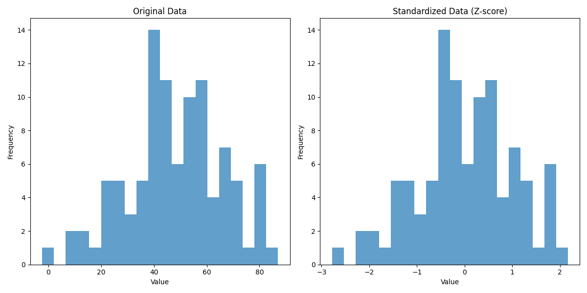
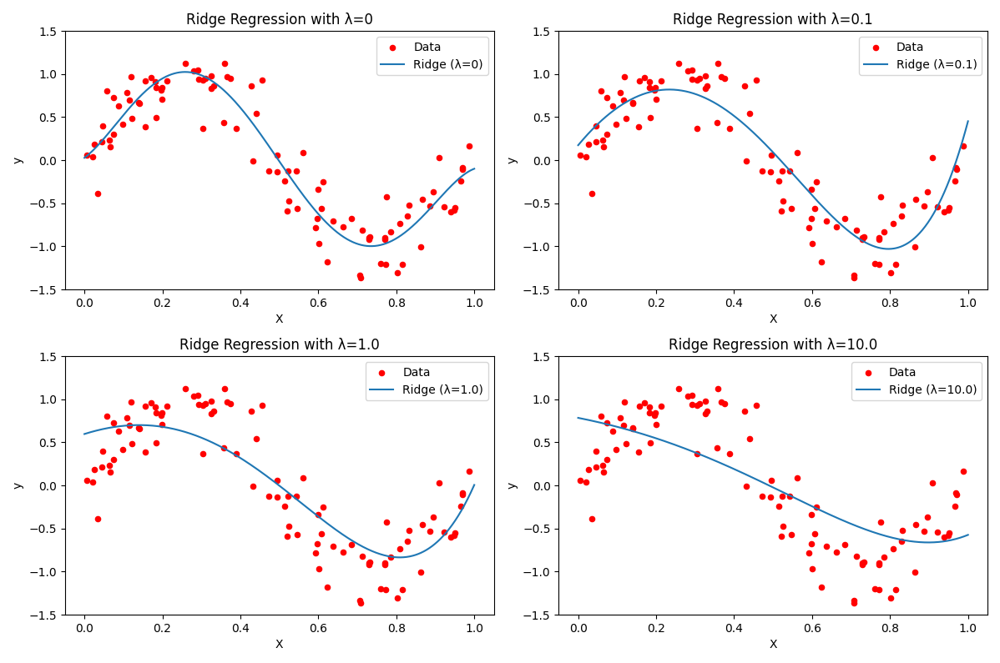
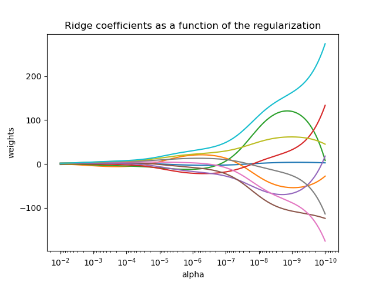
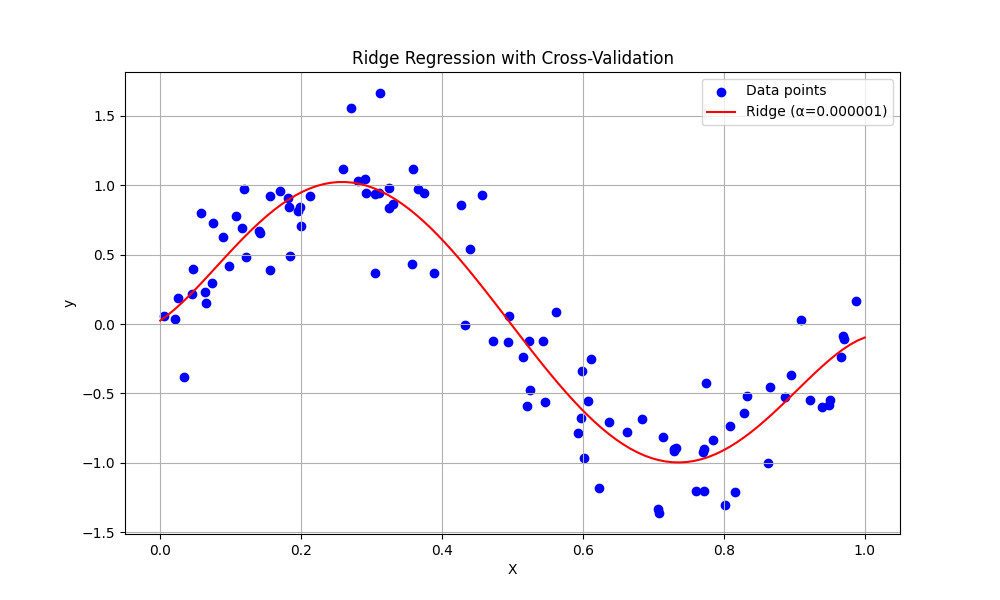
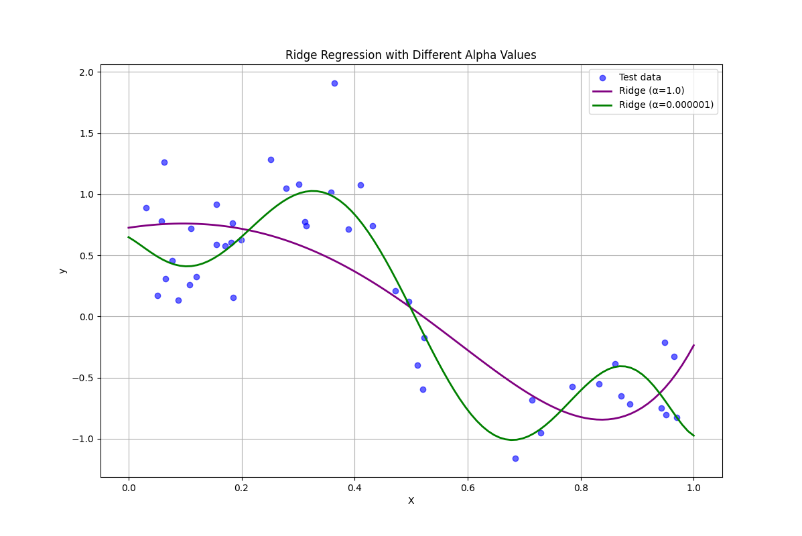
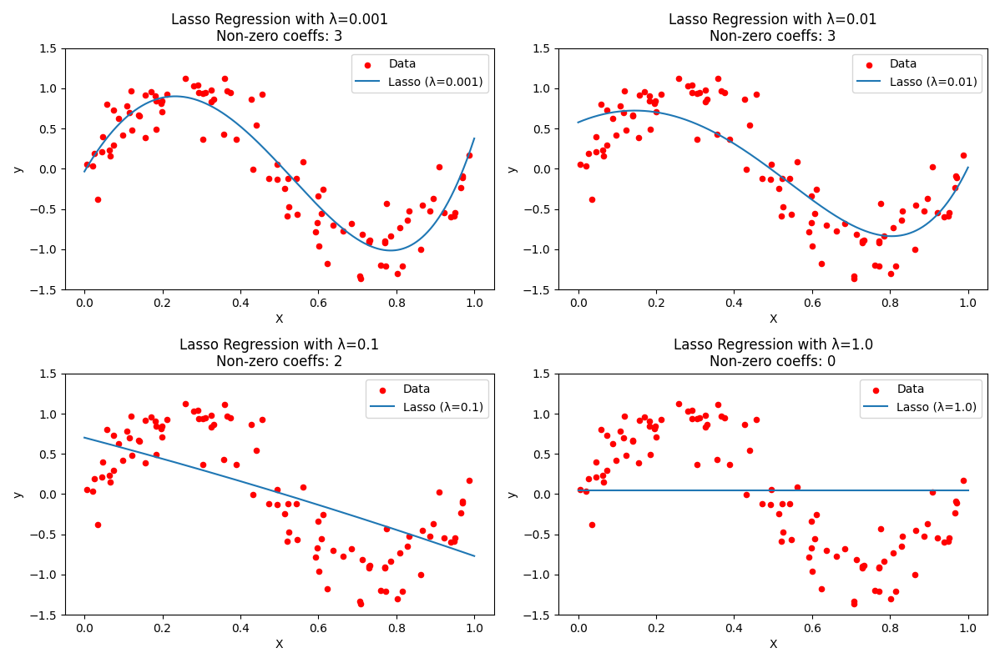
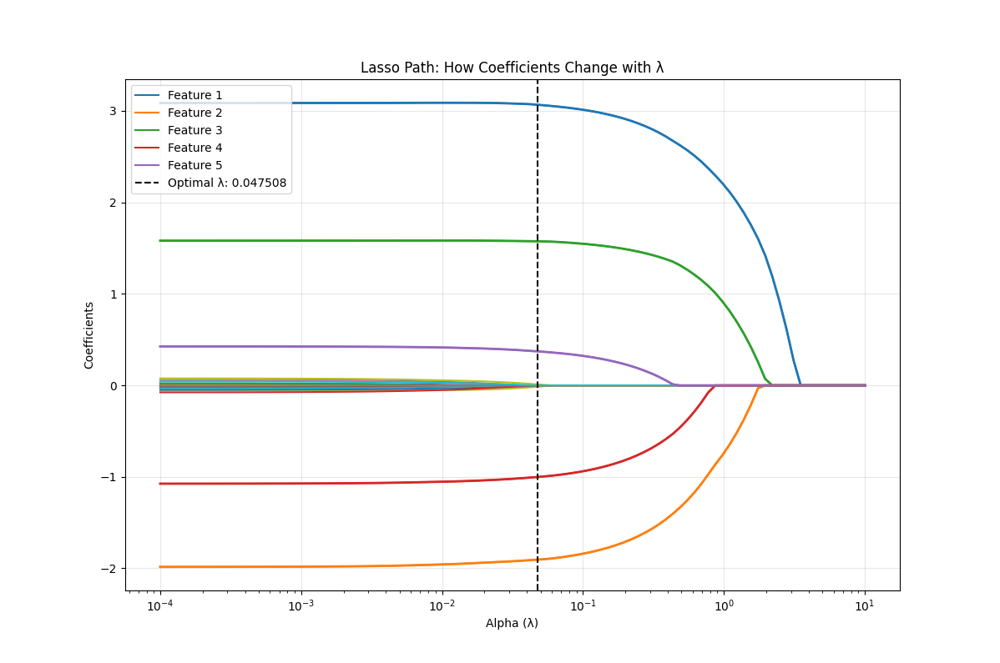

# Feature Scaling and Regularization

## Feature Scaling

Feature scaling is a preprocessing step that transforms numerical features to a comparable scale. This is essential when features have different ranges or units.

### Pros and Cons

**Pros:**
* Accelerates convergence of gradient-based algorithms
* Essential for distance-based algorithms (KNN, K-means)
* Required for regularization techniques (Ridge, Lasso)
* Improves numerical stability
* Makes feature importance comparisons more meaningful

**Cons:**
* Reduces direct interpretability of features (You can no longer easily understand what each feature means or how it affects the outcome)
* Introduces additional preprocessing complexity
* Some methods are sensitive to outliers
* Must be applied consistently to training and test data

### Normalization (Min-Max Scaling)

Normalization rescales features to a specific range, typically [0,1].

**Mathematical formula:**

$$X_{normalized} = \frac{X - X_{min}}{X_{max} - X_{min}}$$

**Visualization:**

```python
import numpy as np
import matplotlib.pyplot as plt
from sklearn.preprocessing import MinMaxScaler

# Generate sample data
np.random.seed(42)
original_data = np.random.normal(loc=50, scale=20, size=100)

# Apply normalization
scaler = MinMaxScaler()
normalized_data = scaler.fit_transform(original_data.reshape(-1, 1)).flatten()

# Visualization
plt.figure(figsize=(12, 6))
plt.subplot(1, 2, 1)
plt.hist(original_data, bins=20, alpha=0.7)
plt.title('Original Data')
plt.xlabel('Value')
plt.ylabel('Frequency')

plt.subplot(1, 2, 2)
plt.hist(normalized_data, bins=20, alpha=0.7)
plt.title('Normalized Data (Min-Max)')
plt.xlabel('Value')
plt.ylabel('Frequency')

plt.tight_layout()
plt.show()
```


### 🔥 Real-Life Example: Credit Scoring in Banks

Imagine a bank is building a model to decide whether to approve a loan. The dataset includes features like:

- **Salary** (e.g., ranges from $20,000 to $200,000)  
- **Age** (e.g., 18 to 100)  
- **Credit Card Debt** (e.g., $0 to $50,000)  
- **Number of Late Payments** (e.g., 0 to 10)

💡 Without normalization, the **salary** feature would dominate the others due to its large numerical range. This can bias the model and make training unstable or ineffective.

✅ To prevent this, the bank **normalizes all features** to a common range (like `[0, 1]` or `[-1, 1]`). This ensures that:

- All features contribute more equally to the learning process  
- The model trains faster and more reliably  
- Gradient descent behaves more consistently across features

> 📌 **Normalization helps the model focus on patterns, not raw scale differences.**

### Standardization (Z-score Normalization)

Standardization transforms data to have zero mean and unit variance.

**Mathematical formula:**

$$X_{standardized} = \frac{X - \mu}{\sigma}$$

Where:
- $\mu$ is the mean of the feature
- $\sigma$ is the standard deviation
  
The standard deviation (σ) is calculated as: $$\sigma = \sqrt{\frac{1}{N} \sum_{i=1}^{N} (x_i - \mu)^2}$$

Where:
- N is the number of samples
- x_i is each individual value
- μ is the mean of the values


**Visualization:**

```python
import numpy as np
import matplotlib.pyplot as plt
from sklearn.preprocessing import StandardScaler

# Generate sample data
np.random.seed(42)
original_data = np.random.normal(loc=50, scale=20, size=100)

# Apply standardization
scaler = StandardScaler()
standardized_data = scaler.fit_transform(original_data.reshape(-1, 1)).flatten()

# Visualization
plt.figure(figsize=(12, 6))
plt.subplot(1, 2, 1)
plt.hist(original_data, bins=20, alpha=0.7)
plt.title('Original Data')
plt.xlabel('Value')
plt.ylabel('Frequency')

plt.subplot(1, 2, 2)
plt.hist(standardized_data, bins=20, alpha=0.7)
plt.title('Standardized Data (Z-score)')
plt.xlabel('Value')
plt.ylabel('Frequency')

plt.tight_layout()
plt.show()
```



**Real-Life Example:**
Blood test results often have different normal ranges. Standardization allows clinicians to compare multiple biomarkers with different units (like cholesterol in mg/dL and hemoglobin in g/dL) on a unified scale to identify abnormal patterns.

## Regularization -- Prevent overfitting !

Regularization techniques help prevent overfitting by adding penalty terms to the model's loss function.

### L2 Regularization (Ridge Regression)

Ridge Regression adds the squared magnitude of coefficients as a penalty term.

**Mathematical formula:**

$$\text{Loss} = \text{MSE} + \lambda \sum_{i=1}^{n} w_i^2$$

$$\text{MSE} = \frac{1}{n} \sum_{i=1}^{n} (y_i - \hat{y}_i)^2$$

Where:
- MSE is the Mean Squared Error
- $\lambda$ (lambda) is the regularization strength (hyperparameter)
- $w_i$ are the model coefficients

**Why Apply Feature Scaling First:**
Ridge Regression's penalty term depends on coefficient magnitude. Without scaling, features with larger scales would be penalized more heavily, leading to biased shrinkage

**Visualization - Effect of Ridge with different λ values:**

```python
import numpy as np
import matplotlib.pyplot as plt
from sklearn.linear_model import Ridge
from sklearn.preprocessing import StandardScaler
from sklearn.pipeline import Pipeline

# Generate synthetic data
np.random.seed(42)
X = np.sort(np.random.rand(100, 1), axis=0)
y = np.sin(2 * np.pi * X).ravel() + np.random.normal(0, 0.3, X.shape[0])

# Add polynomial features to make the problem harder
X_poly = np.hstack([X, X**2, X**3, X**4, X**5])

# Test points
X_test = np.linspace(0, 1, 1000).reshape(-1, 1)
X_test_poly = np.hstack([X_test, X_test**2, X_test**3, X_test**4, X_test**5])

# Create pipelines with different regularization strengths
alphas = [0, 0.1, 1.0, 10.0]
plt.figure(figsize=(12, 8))

for i, alpha in enumerate(alphas):
    # Create a pipeline with standardization and Ridge
    ridge = Pipeline([
        ('scaler', StandardScaler()),
        ('ridge', Ridge(alpha=alpha))
    ])
    
    # Fit model
    ridge.fit(X_poly, y)
    
    # Predict
    y_pred = ridge.predict(X_test_poly)
    
    # Plot
    plt.subplot(2, 2, i+1)
    plt.scatter(X, y, color='red', s=20, label='Data')
    plt.plot(X_test, y_pred, label=f'Ridge (λ={alpha})')
    plt.title(f'Ridge Regression with λ={alpha}')
    plt.xlabel('X')
    plt.ylabel('y')
    plt.ylim(-1.5, 1.5)
    plt.legend()

plt.tight_layout()
plt.show()
```


**Coefficient Shrinkage**



As λ increases:

- Coefficient values decrease, resulting in a simpler model
- The impact of less important features is reduced
- The model becomes more stable, especially with multicollinearity

#### RidgeCV

RidgeCV is a cross-validation implementation that automatically selects the best regularization parameter ($\lambda$) from a given set.

```python
import numpy as np
import matplotlib.pyplot as plt
from sklearn.linear_model import RidgeCV
from sklearn.preprocessing import StandardScaler, PolynomialFeatures
from sklearn.pipeline import Pipeline

# Generate synthetic data
np.random.seed(42)
X = np.sort(np.random.rand(100, 1), axis=0)
y = np.sin(2 * np.pi * X).ravel() + np.random.normal(0, 0.3, X.shape[0])

# Create polynomial features
poly = PolynomialFeatures(degree=5)
X_poly = poly.fit_transform(X)

# Set up RidgeCV with a range of alphas
# 10^(-6) ... 10^(6) divided to 13 intervals
alphas = np.logspace(-6, 6, 13)  # Range of alpha values to test
ridge_cv = RidgeCV(alphas=alphas, cv=5, scoring='neg_mean_squared_error')

# Create and fit the pipeline
# We use StandardScaler before RidgeCV to ensure all features are on the same scale,
# so regularization works fairly and effectively
pipeline = Pipeline([
    ('scaler', StandardScaler()),
    ('ridge_cv', ridge_cv)
])
pipeline.fit(X_poly, y)

# Print the best alpha found
best_alpha = pipeline.named_steps['ridge_cv'].alpha_
print(f"Best alpha: {best_alpha}")

# Visualize the results
X_test = np.linspace(0, 1, 100).reshape(-1, 1)
X_test_poly = poly.transform(X_test)
X_test_poly_scaled = pipeline.named_steps['scaler'].transform(X_test_poly)
y_pred = pipeline.predict(X_test_poly)

plt.figure(figsize=(10, 6))
plt.scatter(X, y, color='blue', label='Data points')
plt.plot(X_test, y_pred, color='red', label=f'Ridge (α={best_alpha:.6f})')
plt.title('Ridge Regression with Cross-Validation')
plt.xlabel('X')
plt.ylabel('y')
plt.legend()
plt.grid(True)
plt.show()

# You can also examine the coefficients
coefficients = pipeline.named_steps['ridge_cv'].coef_
feature_names = [f'X^{i}' for i in range(len(coefficients))]
plt.figure(figsize=(10, 6))
plt.bar(feature_names, coefficients)
plt.title('Ridge Regression Coefficients')
plt.xlabel('Features')
plt.ylabel('Coefficient Value')
plt.xticks(rotation=45)
plt.grid(True, axis='y')
plt.tight_layout()
plt.show()
```


#### Scoring Metrics for RidgeCV

Common scoring metrics for cross-validation:

- **Mean Squared Error (MSE)**: Average squared difference between predicted and actual values
- **R-squared**: Proportion of variance explained by the model
- **Mean Absolute Error (MAE)**: Average absolute difference between predicted and actual values
- **Negative Mean Squared Error**: Used in scikit-learn's cross-validation (which maximizes scores)

```python
import numpy as np
import matplotlib.pyplot as plt
from sklearn.linear_model import Ridge, RidgeCV
from sklearn.preprocessing import StandardScaler, PolynomialFeatures
from sklearn.pipeline import Pipeline
from sklearn.model_selection import train_test_split
from sklearn.metrics import mean_squared_error, r2_score, mean_absolute_error

# Set random seed for reproducibility
np.random.seed(42)

# Generate synthetic data with some noise
X = np.sort(np.random.rand(150, 1), axis=0)
y = np.sin(2 * np.pi * X).ravel() + 0.4 * np.cos(5 * np.pi * X).ravel() + np.random.normal(0, 0.3, X.shape[0])

# Split data into training and testing sets
X_train, X_test, y_train, y_test = train_test_split(X, y, test_size=0.3, random_state=42)

# Create polynomial features
degree = 8  # Higher degree to demonstrate overfitting without regularization
poly = PolynomialFeatures(degree=degree)
X_train_poly = poly.fit_transform(X_train)
X_test_poly = poly.transform(X_test)

# Scale the features
scaler = StandardScaler()
X_train_poly_scaled = scaler.fit_transform(X_train_poly)
X_test_poly_scaled = scaler.transform(X_test_poly)

# Range of alpha values to test (regularization strengths)
alphas = np.logspace(-6, 3, 20)

# 1. First, use Ridge with a fixed small alpha (minimal regularization)
ridge_small = Ridge(alpha=0.001)
ridge_small.fit(X_train_poly_scaled, y_train)

# 2. Use Ridge with alpha=1 (moderate regularization)
ridge_medium = Ridge(alpha=1.0)
ridge_medium.fit(X_train_poly_scaled, y_train)

# 3. Then use RidgeCV to find the optimal alpha
ridge_cv = RidgeCV(alphas=alphas, cv=5, scoring='neg_mean_squared_error')
ridge_cv.fit(X_train_poly_scaled, y_train)
best_alpha = ridge_cv.alpha_

# 4. Create a Ridge model with the best alpha
ridge_best = Ridge(alpha=best_alpha)
ridge_best.fit(X_train_poly_scaled, y_train)

# Make predictions on test data
y_pred_small = ridge_small.predict(X_test_poly_scaled)
y_pred_medium = ridge_medium.predict(X_test_poly_scaled)
y_pred_best = ridge_best.predict(X_test_poly_scaled)

# Calculate and compare metrics
metrics = {
    'Model': ['Ridge (α=0.001)', 'Ridge (α=1.0)', f'Ridge (α={best_alpha:.6f})'],
    'MSE': [
        mean_squared_error(y_test, y_pred_small),
        mean_squared_error(y_test, y_pred_medium),
        mean_squared_error(y_test, y_pred_best)
    ],
    'R²': [
        r2_score(y_test, y_pred_small),
        r2_score(y_test, y_pred_medium),
        r2_score(y_test, y_pred_best)
    ],
    'MAE': [
        mean_absolute_error(y_test, y_pred_small),
        mean_absolute_error(y_test, y_pred_medium),
        mean_absolute_error(y_test, y_pred_best)
    ]
}

# Print the metrics
print(f"Best alpha selected by RidgeCV: {best_alpha:.6f}")
print("\nPerformance Metrics:")
print(f"{'Model':<20} {'MSE':<12} {'R²':<12} {'MAE':<12}")
print("-" * 56)
for i in range(len(metrics['Model'])):
    print(f"{metrics['Model'][i]:<20} {metrics['MSE'][i]:<12.4f} {metrics['R²'][i]:<12.4f} {metrics['MAE'][i]:<12.4f}")

# Visual comparison of the models
X_plot = np.linspace(0, 1, 100).reshape(-1, 1)
X_plot_poly = poly.transform(X_plot)
X_plot_poly_scaled = scaler.transform(X_plot_poly)

y_plot_small = ridge_small.predict(X_plot_poly_scaled)
y_plot_medium = ridge_medium.predict(X_plot_poly_scaled)
y_plot_best = ridge_best.predict(X_plot_poly_scaled)

# plot the data ...
```

כאשר נריץ את הקוד, נקבל פלט דומה לזה:

```
Performance Metrics:
Model                MSE          R²           MAE         
--------------------------------------------------------
Ridge (α=0.001)      0.1105       0.7881       0.2555      
Ridge (α=1.0)        0.1790       0.6569       0.3340      
Ridge (α=0.000001)   0.0892       0.8290       0.2217  
```



**Real-Life Example:**
When predicting housing prices, Ridge Regression performs well because most features (like square footage, number of rooms, neighborhood characteristics) contribute to the price, but with varying importance.

### L1 Regularization (Lasso Regression)

Lasso Regression adds the absolute value of coefficients as a penalty term, which can lead to sparse models

sparse = מדולל

**Mathematical formula:**

$$\text{Loss} = \text{MSE} + \lambda \sum_{i=1}^{n} |w_i|$$

$$\text{MSE} = \frac{1}{n} \sum_{i=1}^{n} (y_i - \hat{y}_i)^2$$

**Lasso Regression** is a predictive modeling technique (regression) that adds a *"penalty"* when the model’s weights (coefficients) get too large — but not just any penalty!  
It adds the **sum of the absolute values of the coefficients**.

- **MSE** – Mean Squared Error (regular prediction error)
- **λ (lambda)** – Penalty strength
- **|βᵢ|** – Absolute value of each coefficient (so negatives don't cancel out)

**✂️ Why does it create a Sparse Model?**

Because **Lasso pushes some coefficients to exactly zero** if they are not important enough!  
In other words: if a feature doesn't really add value to the prediction — the model sets its weight to zero.

**📦 Everyday Example:**

Imagine you're building a model to predict whether someone will like pizza based on:

- Age
- Eye color
- Height
- Whether they are Italian
- Number of cats at home

🤷‍♂️ Probably eye color and number of cats don’t really matter.  
So **Lasso will zero out those feature weights** → and keep only what's truly important (like age and being Italian).

**✅ What do we gain from this?**

- Simpler models  
- Faster models  
- Easier to interpret  
- No time wasted on irrelevant features 💁‍♀️

**Visualization - Effect of Lasso with different λ values:**

```python
import numpy as np
import matplotlib.pyplot as plt
from sklearn.linear_model import Lasso
from sklearn.preprocessing import StandardScaler
from sklearn.pipeline import Pipeline

# Generate synthetic data (same as previous)
np.random.seed(42)
X = np.sort(np.random.rand(100, 1), axis=0)
y = np.sin(2 * np.pi * X).ravel() + np.random.normal(0, 0.3, X.shape[0])
X_poly = np.hstack([X, X**2, X**3, X**4, X**5])
X_test = np.linspace(0, 1, 1000).reshape(-1, 1)
X_test_poly = np.hstack([X_test, X_test**2, X_test**3, X_test**4, X_test**5])

# Create pipelines with different regularization strengths
alphas = [0.001, 0.01, 0.1, 1.0]
plt.figure(figsize=(12, 8))

for i, alpha in enumerate(alphas):
    # Create a pipeline with standardization and Lasso
    lasso = Pipeline([
        ('scaler', StandardScaler()),
        ('lasso', Lasso(alpha=alpha, max_iter=10000))
    ])
    
    # Fit model
    lasso.fit(X_poly, y)
    
    # Get coefficients
    coefs = lasso.named_steps['lasso'].coef_
    
    # Predict
    y_pred = lasso.predict(X_test_poly)
    
    # Plot
    plt.subplot(2, 2, i+1)
    plt.scatter(X, y, color='red', s=20, label='Data')
    plt.plot(X_test, y_pred, label=f'Lasso (λ={alpha})')
    plt.title(f'Lasso Regression with λ={alpha}\nNon-zero coeffs: {np.sum(coefs != 0)}')
    plt.xlabel('X')
    plt.ylabel('y')
    plt.ylim(-1.5, 1.5)
    plt.legend()

plt.tight_layout()
plt.show()
```


#### LassoCV and Optimal Lambda Value

LassoCV uses cross-validation to find the optimal regularization parameter.

```python
from sklearn.linear_model import LassoCV

# Using LassoCV to find optimal alpha
alphas = np.logspace(-6, 0, 100)  # Range of alpha values to test
lasso_cv = LassoCV(alphas=alphas, cv=5, max_iter=10000, random_state=42)
pipeline = Pipeline([
    ('scaler', StandardScaler()),
    ('lasso_cv', lasso_cv)
])

pipeline.fit(X_poly, y)
print(f"Best alpha: {lasso_cv.alpha_}")
print(f"Non-zero coefficients: {np.sum(lasso_cv.coef_ != 0)}")
```

The optimal $\lambda$ balances between underfitting (high $\lambda$, too simple) and overfitting (low $\lambda$, too complex).



**📈 Understanding the Lasso Path Plot**

This plot is called a **Lasso Path**, and it shows how the coefficients of a Lasso regression model change as the regularization strength (`lambda`, or `alpha`) changes.

**🔍 What does the plot show?**

**X-axis**:
- Values of **alpha (λ)**, the regularization strength.
- It's on a **logarithmic scale** (e.g., 10⁻⁴ to 10¹).
- As λ increases → stronger regularization.

**Y-axis**:
- The **coefficient value** for each feature.
- Each line represents how one feature’s weight changes with λ.

**📊 Interpretation:**

🟢 On the left (small λ):
- Regularization is **weak**.
- Most features have **non-zero coefficients**.
- The model includes more features (can overfit).

🔴 Moving right (large λ):
- Regularization gets **stronger**.
- Lasso starts **shrinking coefficients toward 0**.
- Many features are **zeroed out** (removed from the model).

🚩 The vertical dashed line:
- Marks the **optimal alpha** chosen by `LassoCV` (via cross-validation).
- At this λ, the model achieves **best generalization performance**.
- Most irrelevant features have already been **eliminated**.

✅ Why is this plot useful?

- Shows how **Lasso performs feature selection** automatically.
- Helps you understand **which features are important** (those that survive when λ increases).
- Gives insight into the **stability** of your model under different regularization strengths.

🧠 Bottom line:

> As λ increases, Lasso simplifies the model by **zeroing out unimportant features**, leaving only the most relevant ones for prediction.


**Real-Life Example:**
In genomic studies, researchers often have thousands of genetic markers but only a few hundred patients. Lasso helps identify the most relevant genes associated with a disease by setting coefficients of irrelevant genes to zero.

### Lasso vs Ridge Regression Comparison

| Aspect | Ridge Regression | Lasso Regression |
|--------|------------------|------------------|
| Penalty | L2 norm (sum of squared coefficients) | L1 norm (sum of absolute coefficients) |
| Effect on coefficients | Shrinks all coefficients toward zero, but rarely to exactly zero | Can shrink coefficients exactly to zero (feature selection) |
| Solution uniqueness | Always unique | May not be unique when features are correlated |
| Computational complexity | Closed-form solution available | Requires iterative optimization |
| Best use case | When all features contribute to the outcome | When feature selection is desired |
| Handling correlated features | Distributes weight among correlated features | Tends to pick one feature from correlated groups |

## Real-Life Applications

1. **Healthcare Predictive Models**
   - **Problem**: Predicting patient re-admission risk using hundreds of medical variables
   - **Solution**: Feature scaling + Lasso regression to identify key risk factors
   - **Benefit**: Simplified model focusing on the most important predictors, improving clinical usability

2. **Financial Credit Scoring**
   - **Problem**: Predicting credit risk with features on different scales (income, debt ratio, payment history)
   - **Solution**: Standardization + Ridge regression for stability
   - **Benefit**: Balanced consideration of all relevant factors without excessive influence from large-scale features

3. **Housing Price Prediction**
   - **Problem**: Predicting housing prices with features like square footage (large values) and number of rooms (small values)
   - **Solution**: Feature scaling + Elastic Net (combination of L1 and L2)
   - **Benefit**: Accurate price prediction model that balances feature selection and coefficient stability

4. **Image Classification Performance**
   - **Problem**: Optimizing neural network performance for image classification
   - **Solution**: Normalize pixel values from [0,255] to [0,1]
   - **Benefit**: Faster convergence and improved model accuracy
