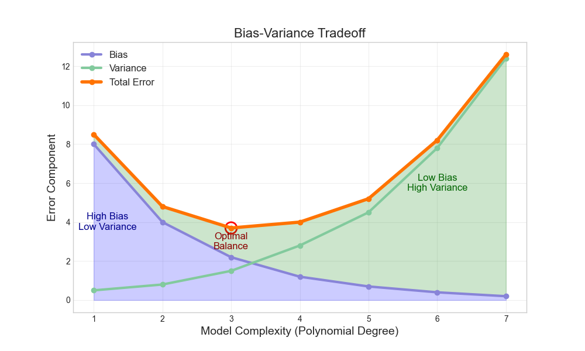
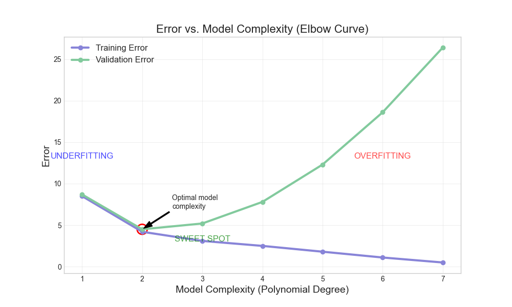
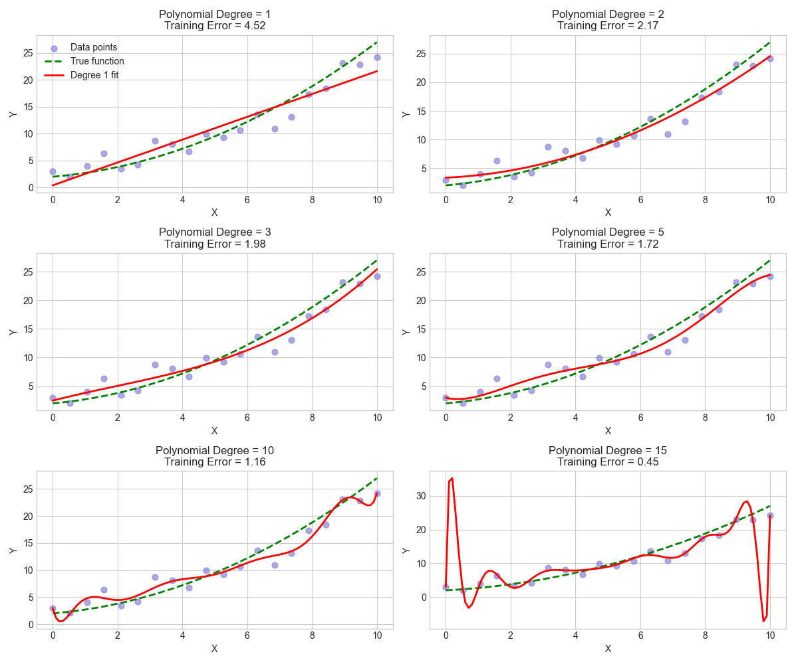

# Understanding Model Overfitting & Underfitting

## Bias-Variance Tradeoff: Finding the Sweet Spot

When we build predictive models, we're trying to find the perfect balance between two competing concerns:

1. **Making the model complex enough** to capture the true patterns in our data
2. **Keeping the model simple enough** that it doesn't just memorize the data and can generalize to new examples

This balancing act is known as the **bias-variance tradeoff**, and it's at the heart of understanding overfitting and underfitting.

## Overfitting and Underfitting Explained

Imagine you're teaching a child to recognize dogs. There are three approaches you might take:

### 1. Underfitting (High Bias)
This is like telling the child, "If it has four legs, it's a dog." This rule is too simple and will misclassify many animals (cats, horses, etc.). The model has:
- **High bias**: Strong, incorrect assumptions about what makes a dog
- **Low variance**: Consistently makes the same mistakes across different situations
- **Problem**: Cannot capture the true pattern (what actually makes a dog a dog)

### 2. Good Fit (Balanced)
You teach the child a reasonable set of features: "Dogs have four legs, a tail, fur, and bark." This provides:
- **Balanced bias and variance**: Good general rules that work in most cases
- **Captures the true pattern**: Recognizes most dogs correctly without being confused by exceptions

### 3. Overfitting (High Variance)
You show the child 10 specific dogs and teach them to memorize every detail about each one: "A dog has exactly THIS shade of brown fur, with THIS specific spot pattern, and THIS exact ear shape." This approach has:
- **Low bias**: Makes few assumptions about dogs in general
- **High variance**: Will only recognize dogs that look exactly like the examples
- **Problem**: The model has memorized the training examples rather than learning the general concept

### -- Visualization: 

<image src="fits-1.png"/>

**Underfitting (High Bias)**
- The model (often a straight line) is too simple
- It misses the true pattern in the data
- It has high error on both training and test data

**Good Fit (Balanced)**
- The model captures the true pattern
- It ignores the random noise
- It has low error on both training and test data

**Overfitting (High Variance)**
- The model is too complex and fits the noise
- It wiggles to hit every data point perfectly
- It has very low error on training data but high error on test data

### The Bias-Variance Tradeoff in Practice

Understanding this decomposition helps explain why there's a fundamental tradeoff between bias and variance:

- **Simple models**: Tend to have high bias but low variance
- **Complex models**: Tend to have low bias but high variance

The goal in model selection is to find the sweet spot where the total error (bias² + variance) is minimized, recognizing that the irreducible error sets the ultimate lower bound on what's achievable.

This is why techniques like cross-validation are so important - they help us estimate the total error (including both bias and variance components) so we can select models that will generalize well to new data.

### Bias
**Bias** is the error introduced by approximating a complex problem with a simpler model.

Think of it as stubbornness or oversimplification:
- A high-bias model is like a stubborn person who has made up their mind before seeing all the evidence
- It consistently misses important patterns in the data
- It tends to underfit the data, making similar mistakes across different datasets

**Example**: Using a straight line to fit curved data will always have bias, no matter how perfectly you position the line.

### Variance
**Variance** refers to how much your model's predictions fluctuate for different training data.

Think of it as being too impressionable or inconsistent:
- A high-variance model is like someone who changes their opinion drastically based on the last person they talked to
- It's overly sensitive to small fluctuations in the training data
- It tends to overfit, performing very well on training data but poorly on new data

**Example**: If adding or removing a few data points dramatically changes your model's predictions, you have high variance.

## The Bias-Variance Tradeoff

The key insight is that these two types of errors are in tension with each other:
- As you reduce bias (by using more complex models), variance tends to increase
- As you reduce variance (by using simpler models), bias tends to increase

The total error in your model is the sum of:
- Bias²
- Variance
- Irreducible error (noise in the data)

The goal is to find the sweet spot where the total error is minimized.

### -- Visualization: 

This graph shows:
- Bias decreases as model complexity increases
- Variance increases as model complexity increases
- Total error (bias + variance) is minimized at an intermediate complexity level

## Finding the Optimal Model Complexity

### The Elbow Curve Method

To find the right level of complexity for your model:

1. Train models of increasing complexity (e.g., polynomials of increasing degree)
2. Plot the training error and validation error against model complexity
3. Look for the "elbow point" where validation error starts to increase
4. Choose the model complexity at this elbow point

In the graph above:
- Very simple models (degree 1) have high training and validation error
- As complexity increases, both errors decrease initially
- At some point (around degree 2-3), validation error starts increasing while training error continues to decrease
- The optimal complexity is at this turning point

### Finding the Most Fit Polynomial Degree

When working with polynomial regression specifically:

1. Split your data into training and validation sets
2. For each degree (1, 2, 3, etc.):
   - Fit a polynomial of that degree to the training data
   - Calculate error on both training and validation sets
3. Plot both errors against the polynomial degree
4. Choose the degree where validation error is minimized

## Real-World Examples

### Example 1: Medical Diagnosis
- **Underfitting**: A system that only checks body temperature to diagnose all illnesses
- **Good fit**: A system that considers multiple symptoms, vital signs, and medical history
- **Overfitting**: A system that memorizes specific patients' exact combinations of symptoms and can't generalize to new patients

### Example 2: House Price Prediction
- **Underfitting**: Using only house size to predict prices
- **Good fit**: Using size, location, number of rooms, age, and other important factors
- **Overfitting**: Using extremely specific details like the exact shade of paint in each room or the brand of doorknobs

### Example 3: Customer Behavior
- **Underfitting**: Assuming all customers behave the same way
- **Good fit**: Segmenting customers based on important demographics and behavior patterns
- **Overfitting**: Creating a unique profile for each individual customer that doesn't generalize to new customers

## Practical Techniques to Avoid Overfitting

1. **Use more training data**: More data helps the model learn the true pattern
2. **Feature selection**: Remove irrelevant features
3. **Regularization**: Add penalties for model complexity (L1/L2 regularization)
4. **Cross-validation**: Test on multiple data splits
5. **Early stopping**: Stop training when validation error starts increasing
6. **Ensemble methods**: Combine multiple models (random forests, boosting)
7. **Dropout**: Randomly disable nodes during training (for neural networks)

## Practical Techniques to Avoid Underfitting

1. **Add more features**: Include more relevant variables
2. **Increase model complexity**: Use higher-degree polynomials or more flexible models
3. **Reduce regularization**: Decrease the penalty for model complexity
4. **Feature engineering**: Create new features that better capture the patterns
5. **Try different model architectures**: Some models may be better suited to your data

## Key Takeaways

1. **Underfitting** (high bias) means your model is too simple to capture the true pattern
2. **Overfitting** (high variance) means your model is too complex and captures noise along with the pattern
3. The **bias-variance tradeoff** is about finding the sweet spot between these two extremes
4. Use **validation data** to detect when a model starts to overfit
5. The **elbow method** helps identify the optimal model complexity
6. Different **techniques** can help address both underfitting and overfitting

## Conclusion

Finding the right model complexity is both an art and a science. By understanding the bias-variance tradeoff, you can build models that generalize well to new data, rather than models that are either too simplistic or that merely memorize the training data.

The key is to use validation techniques to find the sweet spot where your model captures the true patterns in the data without being led astray by noise. This balanced approach leads to models that make reliable predictions on new, unseen data — which is the ultimate goal of machine learning.

## Appendix A - Bias and Variance in Detail

**The Bias-Variance Decomposition**

When analyzing model performance, the total expected prediction error can be mathematically decomposed into three fundamental components:

**$$\text{Total Error} = \text{Bias}^2 + \text{Variance} + \text{Irreducible Error}$$**

Let's explore each of these components in detail:

### What is Bias?

Bias measures how far your model's predictions are from the true values on average. It represents the error introduced by approximating a complex real-life problem with a simpler model.

- **High bias** indicates that your model is making systematic errors and consistently missing the true pattern
- **Examples of high-bias models**: Linear models trying to fit non-linear data, overly simplified decision trees

### Why should we use Bias²?

In the mathematical decomposition of the expected prediction error, bias appears as a squared term for several important reasons:

1. **Mathematical derivation**: When you derive the expected prediction error formula, the bias term naturally appears squared in the equations.

2. **Directionality**: Bias can be positive (overestimation) or negative (underestimation), but its contribution to error must always be positive. Squaring ensures that both positive and negative bias contribute positively to the total error.

3. **Consistency with variance**: Since variance is already defined as a squared quantity, having bias squared keeps the units and scale consistent across the formula.

4. **Emphasis on larger errors**: Squaring gives more weight to larger biases, which aligns with how we typically want to penalize prediction errors in machine learning.

### What is Variance?

Variance measures how much your model's predictions would fluctuate (=change frequently) if you trained it on different datasets. It represents the model's sensitivity to the specific data points used for training.

- **High variance** indicates that your model is overly sensitive to small fluctuations in the training data
- **Examples of high-variance models**: High-degree polynomials, deep decision trees, models with too many parameters

### What is Irreducible Error?

Irreducible error (also called "noise term" or "Bayes error") represents the lower bound on the error you can achieve with any model. This error comes from:

1. **Inherent randomness** in the system you're trying to model
2. **Unmeasured variables** that influence the outcome but aren't captured in your data
3. **Measurement errors** in the data collection process

The irreducible error is the error that would remain even if you had a perfect model that correctly captured all patterns in your data.

### Real-World Example:

If you're predicting house prices, irreducible error exists because:
- Some buyers might pay more for subjective, unmeasurable reasons
- Random market fluctuations affect prices unpredictably
- Not all factors affecting price can be measured (e.g., future neighborhood development plans)

Even if you knew every measurable feature of a house, some randomness would remain in its selling price.