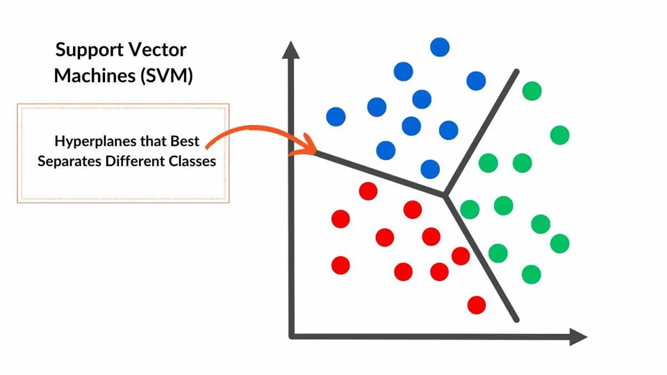
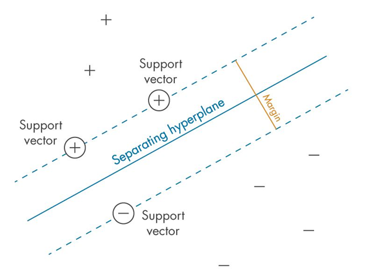
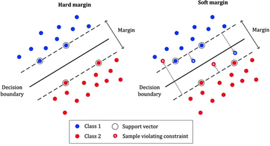
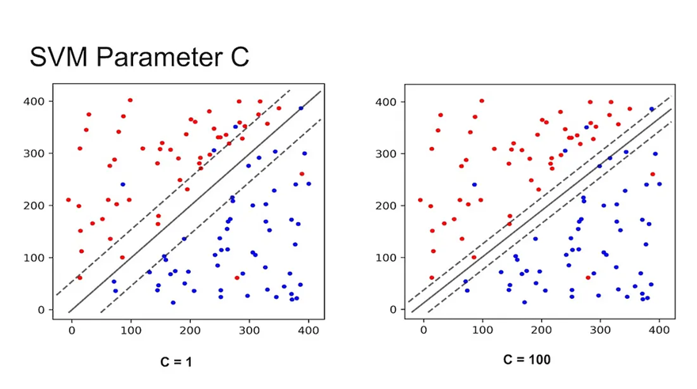
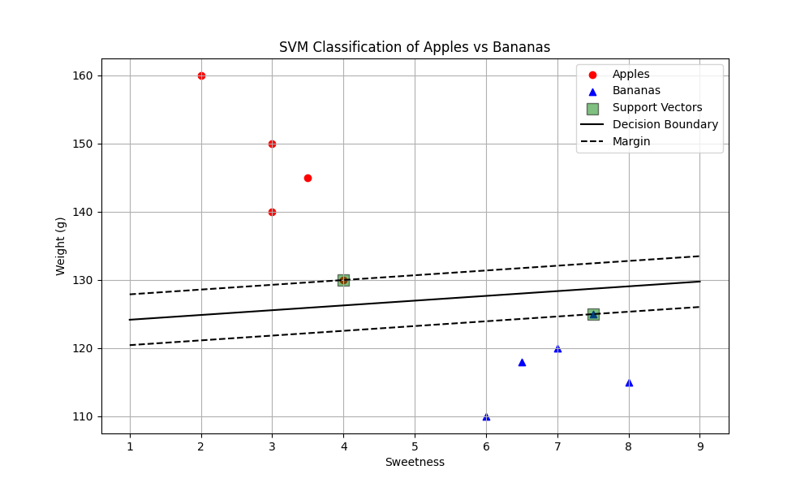
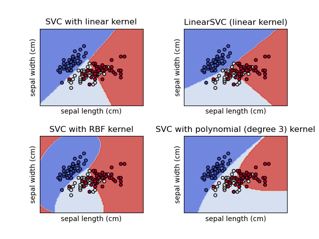
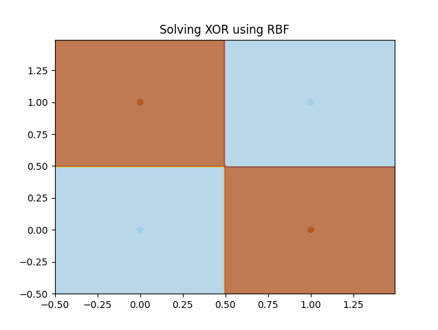
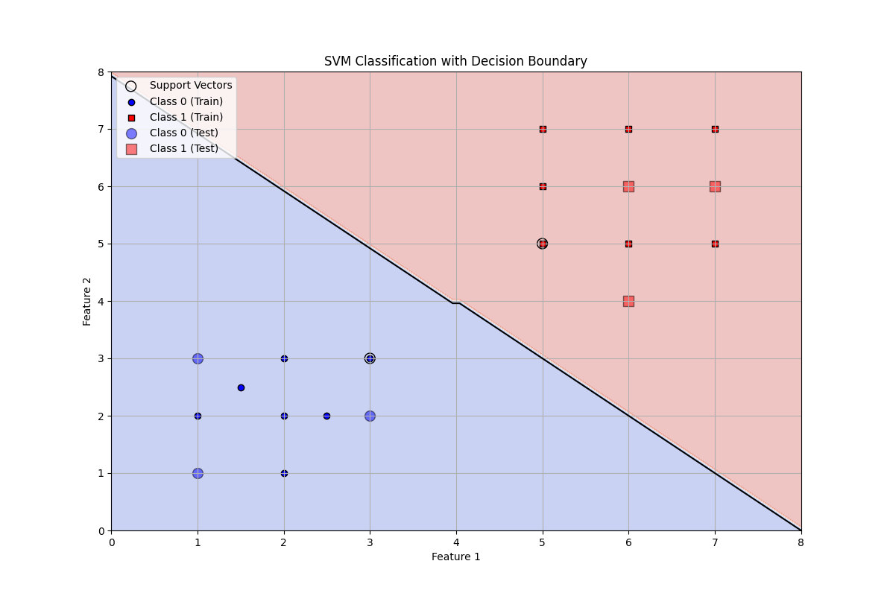
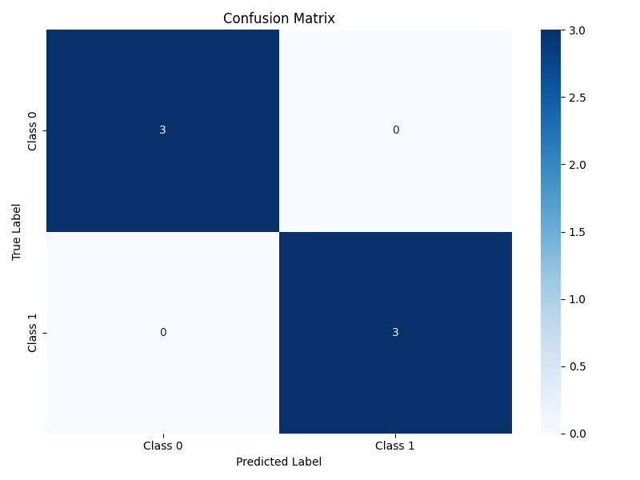
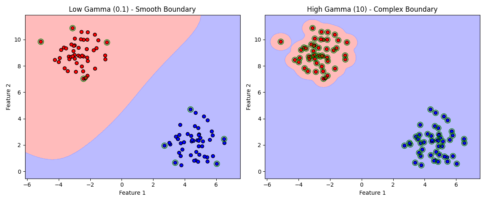

# 🤖 מכונת וקטורים תומכים (SVM – Support Vector Machine)

## 🧠 מה זה SVM?

SVM היא שיטת **למידת מכונה מונחית (Supervised Learning)**, שנועדה:
- **לסווג** דוגמאות (Classification)
- או לבצע **רגרסיה** (Regression – חיזוי ערכים רציפים)

המטרה העיקרית:  
**למצוא את הגבול שמפריד בצורה הכי טובה בין קבוצות שונות של דוגמאות**



## 📈 שימושים נפוצים של SVM

- **זיהוי טקסט וכתב יד**
- **סיווג תמונות**
- **זיהוי פנים**
- **חיזוי במדעי הרפואה**
- **ניתוח רגשות בטקסט**

 זוהי שיטה עוצמתית ללמידת מכונה, והיא משמשת במגוון רחב של תחומים:

- ✍️ **זיהוי טקסט וכתב יד**  
  סיווג של אותיות או ספרות, לדוגמה OCR (זיהוי תווים אופטי)

- 🖼️ **סיווג תמונות**  
  לדוגמה: זיהוי אם תמונה היא של חתול או כלב, או צילום רפואי תקין/חריג

- 🙂 **זיהוי פנים**  
  השוואת פנים לצורך אימות זהות

- 🧬 **חיזוי במדעי הרפואה**  
  לדוגמה: חיזוי תוצאות של טיפולים רפואיים או מחלות

- 💬 **ניתוח רגשות בטקסט**  
  זיהוי אם הודעה היא חיובית, שלילית או נייטרלית (Sentiment Analysis)

💡 *למרות ההתפתחות של רשתות נוירונים, SVM נשאר רלוונטי במיוחד כשיש מעט דוגמאות ודאטה איכותי*

---

## 🎯 מה המטרה של SVM?

למצוא את **הקו/מישור (Hyperplane)** שמפריד בצורה מקסימלית בין קבוצות 
המטרה היא להגדיל את המרחק מהקו אל הנקודות הקרובות ביותר – הנקראות **וקטורים תומכים**

**וקטורים תומכים – Support Vectors**

הנקודות הקרובות ביותר לקו ההפרדה

- הן אלו שקובעות את מיקום הקו
- אם תזיז נקודה אחרת – הקו לא יזוז
- אם תזיז וקטור תומך – הקו ישתנה

📌 אלה "הנקודות החשובות ביותר" באימון של SVM



**למה "וקטור תומך" ולא "נקודה תומכת"?**

ההסבר המתמטי:

במתמטיקה, בפרט בגיאומטריה ולמידת מכונה:

כל נקודה במרחב מיוצגת כ־וקטור

לדוגמה: [3, 4] זו נקודה, אבל גם וקטור מהמוצא (0,0) אל [3, 4]

כלומר: נקודה = וקטור שמראה לאן "להגיע" מהראשית

אז במונחים של למידת מכונה:

הנתונים שלנו הם וקטורים במרחב

ולכן גם ה־Support Vectors הם וקטורים שנמצאים הכי קרוב למישור ההפרדה

ולמה "תומך"?
כי הם אלו ש:

תומכים במיקום של מישור ההפרדה

כלומר: הם אלו שקובעים אותו

אם תזיז אחד מהם — המישור יזוז!

---

## ❓ למה נקודות התמיכה (Support Vectors) כל כך חשובות ב־SVM?
**והאם הקו **חייב** לעבור דרכן?**


### ✏️ מהי משוואת מישור?

משוואת מישור

```
wᵀx + b = 0
```

- `w` הוא **וקטור המשקלים** (הכיוון של המישור)
- `x` הוא **וקטור הנקודה** (כל נקודה במרחב)
- `wᵀx` זה כמו מכפלה סקלרית: `w₁x₁ + w₂x₂ + ...`
- `b` הוא **היסט (bias)** – קובע איפה המישור נחתך עם הציר

🔍 דוגמה ב־2D:

נניח:

```
w = [2, -3]
b = 6
```

אז משוואת המישור היא:

```
2x₁ - 3x₂ + 6 = 0
```

זו משוואת קו ישר ב־2D.

- אם `wᵀx + b > 0` → הנקודה בצד אחד של המישור
- אם `wᵀx + b < 0` → בצד השני
- אם `wᵀx + b = 0` → הנקודה נמצאת **בדיוק על המישור**

### 🛤️ מה זה Hyperplane?

- ב־2D: קו ישר
- ב־3D: משטח
- ב־4D ומעלה: פשוט נקרא "Hyperplane"


## ✅ מה הן נקודות התמיכה?

- נקודות התמיכה הן **הנקודות הקרובות ביותר למישור המפריד**
- הן יושבות בדיוק **על גבולות הרווח** (margin boundaries)
- הן מקיימות את התנאי:

$$
y_i(w^T x_i + b) = 1 \quad \text{או} \quad -1
$$

- `xᵢ` — וקטור של תכונות (פיצ'רים) של הנקודה
- `yᵢ` — **התווית האמיתית** (לייבל) של הנקודה:
  - `+1` אם היא שייכת למחלקה אחת
  - `-1` אם היא שייכת למחלקה השנייה

### 📐 האם הקו חייב לעבור דרכן?

### 🔹 המישור המרכזי (ההיפר־פליין):

$$
w^T x + b = 0
$$

- **לא עובר דרך נקודות התמיכה**
- הוא עובר **באמצע** בין שתי הקבוצות


### 🔹 גבולות הרווח (margin boundaries):

- גבול עליון:

$$
w^T x + b = +1
$$

- גבול תחתון:

$$
w^T x + b = -1
$$

✅ **כן! גבולות הרווח חייבים לעבור דרך נקודות התמיכה.**

## 💡 למה הן הכי חשובות?

- כי רק נקודות התמיכה משפיעות על הפתרון
- כל שאר הנקודות **לא משנות את המיקום של ההיפר־פליין**
- הפתרון של \( w \) מבוסס אך ורק עליהן

$$
w = \sum_i \alpha_i y_i x_i
$$

יש וקטור תומך רק כאשר αᵢ ≠ 0

| ערך של αᵢ | מה זה אומר?                         |
|----------------------|--------------------------------------|
| αᵢ = 0     | הדוגמה לא משפיעה (לא וקטור תומך)     |
| αᵢ > 0     | הדוגמה כן משפיעה (וקטור תומך)        |
| αᵢ = C     | הדוגמה יושבת על הגבול המותר ב־ Soft Margin |

## 🧠 סיכום :

| מרכיב | עובר דרך נקודות התמיכה? |
|--------|---------------------------|
| המישור המרכזי  wᵀx + b = 0 | ❌ לא חייב |
| גבולות הרווח wᵀx + b = ±1 | ✅ כן, חייב |

ולכן הן נקראות **וקטורי תמיכה** – הן ממש **תומכות** במיקום של הקו! 💙


---

## 🔓 מרווח רך – Soft Margin ומרווח קשה - Hard Margin

בעולם האמיתי הנתונים לא תמיד מופרדים בצורה מושלמת.

**Soft Margin:**
- מאפשר כמה טעויות קטנות
- נותן למודל להיות **גמיש יותר**
- עוזר למנוע **Overfitting**

**Hard Margin:**

מניחים שהנתונים ניתנים להפרדה בצורה מושלמת – אין שגיאות!

כלומר: אפשר למצוא קו שמפריד 100% נכון בין הקבוצות.

מאפיינים:

לא מאפשר אף טעות (אין נקודות בצד הלא נכון)

דורש שהנתונים יהיו ליניארית נפרדים (linearly separable)

מאוד רגיש לרעש — נקודה אחת שגויה יכולה להרוס הכול

📉 מתי להשתמש:

רק כשאתה בטוח שאין חפיפה בין המחלקות

לא מתאים לרוב המקרים האמיתיים



---

## ⚙️ פרמטר C

פרמטר חשוב מאוד ב־SVM שמחליט **כמה נאפשר טעויות**:

| ערך C | מה זה עושה? |
|-------|---------------|
| גבוה  | פחות סלחני לטעויות (מודל קשיח, פחות גמיש) |
| נמוך  | סלחני יותר – מאפשר שגיאות קטנות (מודל כללי יותר) |



---

## דוגמא בפייטון

```python
import numpy as np
import matplotlib.pyplot as plt
from sklearn import svm

# Create a simple dataset for apples and bananas
# Using two features: sweetness (x-axis) and weight (y-axis)
apples = np.array([[3, 150], [4, 130], [2, 160], [3, 140], [3.5, 145]])
bananas = np.array([[7, 120], [6, 110], [8, 115], [7.5, 125], [6.5, 118]])

# Combine features and create labels (-1 for apples, 1 for bananas)
X = np.vstack([apples, bananas])
y = np.array([-1, -1, -1, -1, -1, 1, 1, 1, 1, 1])

# Create and train the SVM model
# Using a linear kernel for simplicity
clf = svm.SVC(kernel='linear', C=1000)  # clf=classifier
clf.fit(X, y)

# Extract the model parameters
w = clf.coef_[0]  # The weights (normal vector to the hyperplane)
b = clf.intercept_[0]  # The bias (b in w·x + b = 0)
print(f"Model weights (w): {w}")
print(f"Model bias (b): {b}")

# Create a new test point
test_point = np.array([[5, 135]])  # A point with sweetness=5, weight=135
prediction = clf.predict(test_point)[0]
class_name = "Banana" if prediction == 1 else "Apple"
print(class_name)
```



Output:
```
Model weights (w): [ 0.18791946 -0.26845638]
Model bias (b): 33.14765100671113
Apple

Decision boundary equation: 0.19*x1 + -0.27*x2 + 33.15 = 0
```

## 🌌 גרעין – Kernel

כאשר הנתונים **לא ניתנים להפרדה בקו ישר**, נשתמש בקרנלים כדי להפוך את המרחב:

- נבצע **מיפוי ל־מרחב חדש** (לרוב גבוה יותר)
- במרחב החדש – כן ניתן להפריד ביניהם בקו ישר!


## 🎩 Kernel Trick

"טריק מתמטי" שמאפשר:
- לחשב את **המכפלה הפנימית במרחב החדש**
- בלי באמת לחשב את המיקום החדש של כל נקודה!

זה חוסך **הרבה מאוד זמן וזיכרון**.


## 📌 סוגי Kernels נפוצים:

- **Linear** – מתאים כשאפשר להפריד בקו ישר
- **Polynomial** – מתאים כשיש קשרים מורכבים
- **RBF (Gaussian)** – ברירת מחדל, מתאים להרבה בעיות
- **Sigmoid** – כמו נוירונים ברשת עצבית


דוגמא להפרדה לסוגי פרחים שונים על פי אורך עלי הכותרת SEPAL


---

## 🔍 דוגמא - בעיית XOR

בעיית XOR היא דוגמא קלאסית לנתונים שלא ניתנים להפרדה בקו ישר:



### עם קרנל RBF ניתן לפתור את בעיית XOR:

```python
from sklearn.svm import SVC
import matplotlib.pyplot as plt
import numpy as np

# סט נתונים של XOR
X = np.array([[0, 0], [0, 1], [1, 0], [1, 1]])
y = np.array([0, 1, 1, 0])

# יצירת מודל עם קרנל RBF
model = SVC(kernel='rbf')
model.fit(X, y)

# הדמיה
h = 0.01
x_min, x_max = -0.5, 1.5
y_min, y_max = -0.5, 1.5
xx, yy = np.meshgrid(np.arange(x_min, x_max, h),
                     np.arange(y_min, y_max, h))

Z = model.predict(np.c_[xx.ravel(), yy.ravel()])
Z = Z.reshape(xx.shape)

plt.contourf(xx, yy, Z, cmap=plt.cm.Paired, alpha=0.8)
plt.scatter(X[:, 0], X[:, 1], c=y, cmap=plt.cm.Paired)
plt.title('Solving XOR using RBF')
plt.show()
```


מבנים שלא ניתנים לחלוקה על ידי קו ישר:


---

## חלוקה ל train-test ובדיקת דיוק

```python
import numpy as np
import matplotlib.pyplot as plt
from sklearn import svm
from sklearn.model_selection import train_test_split
from sklearn.metrics import classification_report, confusion_matrix, accuracy_score
from sklearn.preprocessing import StandardScaler
import seaborn as sns

# Create a dataset with 20 points manually
# Class 0: Points forming a cluster on the left
# Class 1: Points forming a cluster on the right
X = np.array([
    # 10 points for Class 0
    [2, 3], [1, 2], [2, 2], [1, 3], [3, 2],
    [2, 1], [1, 1], [3, 3], [2.5, 2], [1.5, 2.5],
    
    # 10 points for Class 1
    [6, 5], [5, 6], [7, 6], [6, 7], [5, 5],
    [7, 5], [6, 6], [5, 7], [7, 7], [6, 4]
])

# Create labels (0 for first 10 points, 1 for last 10 points)
y = np.array([0, 0, 0, 0, 0, 0, 0, 0, 0, 0, 1, 1, 1, 1, 1, 1, 1, 1, 1, 1])

# Split the data into training and testing sets (70% train, 30% test)
X_train, X_test, y_train, y_test = train_test_split(X, y, test_size=0.3, random_state=42, stratify=y)

# Scale the features for better SVM performance
scaler = StandardScaler()
X_train_scaled = scaler.fit_transform(X_train)
X_test_scaled = scaler.transform(X_test)

# Create and train the SVM model
clf = svm.SVC(kernel='linear', C=1.0)
clf.fit(X_train_scaled, y_train)

# Make predictions on the test set
y_pred = clf.predict(X_test_scaled)

# Evaluate the model
accuracy = accuracy_score(y_test, y_pred)
conf_matrix = confusion_matrix(y_test, y_pred)
class_report = classification_report(y_test, y_pred)

# Print performance metrics
print(f"Model Accuracy: {accuracy:.2f}")
print("\nConfusion Matrix:")
print(conf_matrix)
print("\nClassification Report:")
print(class_report)

# Plot the confusion matrix as a heatmap
plt.figure(figsize=(8, 6))
sns.heatmap(conf_matrix, annot=True, fmt='d', cmap='Blues',
            xticklabels=['Class 0', 'Class 1'],
            yticklabels=['Class 0', 'Class 1'])
plt.title('Confusion Matrix')
plt.xlabel('Predicted Label')
plt.ylabel('True Label')
plt.tight_layout()
plt.show()
```





Output:
```
Model Accuracy: 1.00

Confusion Matrix:
[[3 0]
 [0 3]]

Classification Report:
              precision    recall  f1-score   support

           0       1.00      1.00      1.00         3
           1       1.00      1.00      1.00         3

    accuracy                           1.00         6
   macro avg       1.00      1.00      1.00         6
weighted avg       1.00      1.00      1.00         6
```

## שימוש ב- GridSearchCV למציאת הפרמטרים האידיאליים

The **gamma parameter** is a crucial hyperparameter in SVM that determines the influence of individual training examples. It's primarily used in non-linear kernels like 

RBF (Radial Basis Function), polynomial, and sigmoid

High gamma values (e.g., 10, 100):

Creates a decision boundary with "tight" curves around individual data points

Low gamma values (e.g., 0.001, 0.01):

Creates a decision boundary with smoother, wider curves



```python
import numpy as np
import pandas as pd
import matplotlib.pyplot as plt
from sklearn import svm, datasets
from sklearn.model_selection import train_test_split, GridSearchCV
from sklearn.metrics import classification_report, confusion_matrix, accuracy_score
from sklearn.preprocessing import StandardScaler
import seaborn as sns
from time import time

# Load the digits dataset (larger dataset with 1797 samples, 64 features, 10 classes)
digits = datasets.load_digits()
X = digits.data
y = digits.target

print(f"Dataset shape: {X.shape} - {X.shape[0]} samples, {X.shape[1]} features")
print(f"Number of classes: {len(np.unique(y))}")

# Split the data into training and testing sets (80% train, 20% test)
X_train, X_test, y_train, y_test = train_test_split(X, y, test_size=0.2, random_state=42, stratify=y)

# Scale the features
scaler = StandardScaler()
X_train_scaled = scaler.fit_transform(X_train)
X_test_scaled = scaler.transform(X_test)

# Define a smaller parameter grid to make computation more manageable
# but still diverse enough to show differences between kernels
param_grid = {
    'C': [0.1, 1, 10],
    'gamma': ['scale', 0.01, 0.1],  # scale gamma:  1 / (n_features * [variance of X.var])
    'kernel': ['linear', 'rbf', 'poly', 'sigmoid'],
    'degree': [2, 3]  # Only relevant for poly kernel
}

# Create an SVM classifier
svm_clf = svm.SVC(probability=True, random_state=42)

# Set up GridSearchCV
print("Starting grid search. This might take a few minutes with this larger dataset...")
start_time = time()
grid_search = GridSearchCV(
    estimator=svm_clf,
    param_grid=param_grid,
    cv=3,  # Reduce to 3-fold cross-validation for speed
    n_jobs=-1,  # Use all available cores
    verbose=1,
    scoring='accuracy',
    return_train_score=True
)

# Perform the grid search
grid_search.fit(X_train_scaled, y_train)
search_time = time() - start_time

# Print the best parameters
print(f"\nGrid search completed in {search_time:.2f} seconds")
print(f"Best parameters: {grid_search.best_params_}")

```


Output:
```
Dataset shape: (1797, 64) - 1797 samples, 64 features
Number of classes: 10
Starting grid search. This might take a few minutes with this larger dataset...
Fitting 3 folds for each of 72 candidates, totalling 216 fits

Grid search completed in 5.38 seconds
Best parameters: {'C': 10, 'degree': 2, 'gamma': 0.01, 'kernel': 'rbf'}
```


