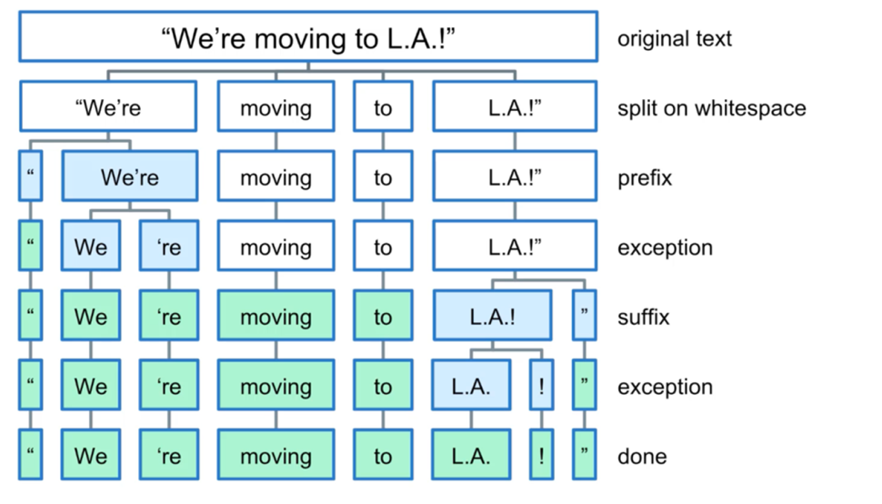

# ניתוח טקסט עם SpaCy – פונקציונליות בסיסית

#### טעינת המודל וניתוח משפט

כדי לנתח טקסט עם **spaCy**, צריך קודם לטעון את המודל לשפה האנגלית – `en_core_web_sm`
המודל מבצע **טוקניזציה** (פירוק של הטקסט למילים או ביטויים) ומחזיר אובייקט מסוג `Doc`, שמכיל את המידע הלשוני על כל מילה

```python
import spacy
nlp = spacy.load("en_core_web_sm")

# The model response is a SpaCy Doc object
doc = nlp("Tesla is looking at buying U.S. startup for $6 million")

for token in doc:
    print(f'[{token.pos:3}]', token.text, token.pos_, token.dep_)
```

Output:
```
[ 96] Tesla PROPN nsubj
[ 87] is AUX aux
[100] looking VERB ROOT
[ 85] at ADP prep
[100] buying VERB pcomp
[ 96] U.S. PROPN dobj
[100] startup VERB advcl
[ 85] for ADP prep
[ 99] $ SYM quantmod
[ 93] 6 NUM compound
[ 93] million NUM pobj
```

הפלט כולל טוקנים עם מאפיינים כמו:

* `text` → הטקסט של המילה
* `pos` part-of-speech tag as an integer → תג חלק הדיבר כמספר (int)
* `pos_`string representation of the POS tag (more human) → סוג המילה (שם עצם, פועל, תואר וכו’) כתיאור מילולי
* `dep_` dependency label → הקשר התחבירי של המילה במשפט (נושא, נשוא, מושא ישיר וכו’)


| טוקן (text) | POS\_ |                | DEP\_    | הסבר בעברית                             | Explanation (English)                                           |
| ----------- | ----- | ------------------------- | -------- | ---------------------------------------- | ---------------------------------------------------------------- |
| Tesla       | PROPN | שם עצם פרטי (Proper Noun) | nsubj    | נושא המשפט                              | **Nominal Subject** – the subject performing the action          |
| is          | AUX   | פועל עזר (Auxiliary Verb) | aux      | פועל עזר של הפועל המרכזי               | **Auxiliary** – helps the main verb form tense, mood, or voice   |
| looking     | VERB  | פועל (Verb)               | ROOT     | הפועל המרכזי במשפט                     | **Root** – the main verb of the sentence                         |
| at          | ADP   | מילת יחס (Adposition)     | prep     | מילת יחס שמקשרת לפועל                  | **Prepositional Modifier** – links a prepositional phrase to the verb |
| buying      | VERB  | פועל (Verb)               | pcomp    | משלים של הפועל באמצעות מילת יחס        | **Prepositional Complement** – the verb that completes the preposition |
| U.S.        | PROPN | שם עצם פרטי               | dobj     | מושא ישיר של הפועל                     | **Direct Object** – the noun receiving the action of the verb    |
| startup     | VERB  | פועל                      | advcl    | פסוקית נסיבתית שמוסיפה מידע לפועל      | **Adverbial Clause Modifier** – gives extra information about the action |
| for         | ADP   | מילת יחס                  | prep     | מילת יחס שמובילה למושא נוסף            | **Prepositional Modifier** – introduces a prepositional phrase   |
| \$          | SYM   | סימן (Symbol)             | quantmod | תיאור כמות שמקדים מספר                 | **Quantifier Modifier** – modifies a number or quantity          |
| 6           | NUM   | מספר (Numeral)            | compound | תיאור מקדים של שם עצם אחר              | **Compound** – joins with another noun to form a complex noun    |
| million     | NUM   | מספר (Numeral)            | pobj     | מושא של מילת היחס "for"                | **Object of Preposition** – the noun that follows a preposition  |


In linguistic terms, a **proper noun** is a specific type of noun that names a particular
person, place, organization, or sometimes a thing

#### רואים כאן טוקניזציה מתקדמת

* המודל מזהה **U.S.** כטוקן אחד ולא מפצל אותו
* מזהה **\$** כסמל (SYM)
* מזהה **million** כמספר (NUM)

## דוגמא נוספת

```python
import spacy
nlp = spacy.load("en_core_web_sm")

# The model response is a SpaCy Doc object
doc = nlp("Tesla isn't looking into startups anymore")

for token in doc:
    print(f'[{token.pos:3}]', token.text, token.pos_, token.dep_)
```

Output:

```
[ 96] Tesla PROPN nsubj
[ 87] is AUX aux
[ 94] n't PART neg
[100] looking VERB ROOT
[ 85] into ADP prep
[ 92] startups NOUN pobj
[ 86] anymore ADV advmod
```

We can see that the model **splitted the 'isn't' word into 2 separated tokens**

First for the 'is' (AUX - auxiliary verbs) Second for 'n't' (neg - negativity word)

### פירוק של מילים מסובכות

המילה **isn't** מתפצלת לשני טוקנים:

* `is` (פועל עזר)
* `n't` (מילת שלילה)

כדי לא לפצל את המילה המקוצרת isn't לטוקנים is ו־n't, צריך לשנות את חוקי הטוקניזציה של SpaCy

ברירת המחדל של SpaCy מפרידה קונטרקציות, אבל ניתן לבטל זאת ע"י החלפת ברירת המחדל של ה־Tokenizer או ע"י שינוי של infixes ו־suffixes

### פונקציית Exaplin

אם אנחנו רוצים להבין מה המשמעות של תג מסוים שמחזירה לנו spaCy, אפשר להשתמש בפונקציה `spacy.explain` שמספקת הסבר טקסטואלי ברור לכל תג תחבירי או דקדוקי

לדוגמה:

```python
import spacy
import spacy.explain

print(spacy.explain("AUX"))    # auxiliary - Auxiliary verb
print(spacy.explain("nsubj"))  # nominal subject
print(spacy.explain("ROOT"))   # root - Root of the sentence
```

### מה זה Doc?

אובייקט `Doc` הוא תוצאה של עיבוד טקסט בעזרת מודל של spaCy
כאשר מפעילים את המודל על טקסט, מקבלים אובייקט `Doc` שמייצג את כל הטקסט וכולל את כל המידע הלשוני עבורו: טוקנים, מבנה תחבירי, ישויות, משפטים ועוד

```python
import spacy
nlp = spacy.load("en_core_web_sm")
doc = nlp("Apple is looking at buying a startup in the U.K.")
```

האובייקט `doc` הוא רצף של טוקנים. ניתן לעבור עליו כמו על רשימה:

```python
for token in doc:
    print(token.text, token.pos_, token.dep_)
```

### מה זה Span?

המונח `Span` הוא תת־קטע של האובייקט `Doc`. כלומר, רצף של טוקנים שמייצג חלק מהטקסט המקורי – מילה אחת, ביטוי, משפט או אפילו פסקה

```python
span = doc[3:6]  # יוצר Span מהמילים הרביעית עד השישית
print(span.text)
```

בדוגמה הזו `span.text` מחזיר את החלק "at buying a"

### ההבדל בין Doc ל-Span

| תכונה       | Doc                           | Span                              |
| ----------- | ----------------------------- | --------------------------------- |
| הגדרה       | מייצג את כל הטקסט שניתן למודל | תת־קטע מתוך דוק                   |
| כולל טוקנים | כן                            | כן                                |
| כולל משפטים | כן                            | לא בהכרח                          |
| כולל ישויות | כן                            | לא בהכרח                          |
| שימוש עיקרי | ניתוח כולל של הטקסט           | ניתוח ממוקד של ביטוי או קטע בטקסט |

לסיכום: `Doc` הוא המסמך השלם, ו־`Span` הוא חתיכה מתוכו שאפשר לנתח בנפרד

אובייקט מסוג `Span` מייצג קטע (רציף) מתוך `Doc` – כלומר תת-רצף של טוקנים שנוצרו לאחר עיבוד הטקסט. ה-Span שומר על ההקשר מתוך המסמך המקורי ומאפשר לבצע עליו ניתוח תחבירי, סמנטי או אחר, בדיוק כמו על `Doc`

```python
import spacy
nlp = spacy.load("en_core_web_sm")

# מסמך שלם
doc3 = nlp(u"Although commonly attributed to John Lennon from his song \"Beautiful Boy\", the phrase\
\"Life is what happens to us while we are making other plans\" was written by cartoonist Allen Saunders\
 and published in Reader's Digest in 1957, when Lennon was 17.")

# Span מתוך המילים במיקומים 16 עד 30
life_quote = doc3[16:30]

print(life_quote)
print(type(life_quote))
```

פלט:

```
Life is what happens to us while we are making other plans
<class 'spacy.tokens.span.Span'>
```

### מה זה Sents ב-SpaCy?

ה- `Doc.sents` הוא generator של משפטים – כלומר SpaCy מזהה אוטומטית את הגבולות בין משפטים בטקסט ומחזיר כל משפט כאובייקט `Span`

```python
doc4 = nlp('This is the first sentence. This is another sentence. This is the last sentence.')

for sentence in doc4.sents:
    print(sentence)
```

פלט:

```
This is the first sentence.
This is another sentence.
This is the last sentence.
```

### מה זה is\_sent\_start?

ה- `token.is_sent_start` מחזיר `True` אם הטוקן הוא הטוקן הראשון במשפט, ו־`False` אחרת

```python
print(f'word: {doc4[6]}, start a sentence: {doc4[6].is_sent_start}')
print(f'word: {doc4[8]}, start a sentence: {doc4[8].is_sent_start}')
```

פלט:

```
word: This, start a sentence: True
word: another, start a sentence: False
```

### סיכום:

* `Span` = קטע מוגדר מתוך דוק
* `sents` = משפטים ש-ספייסי חילקה אוטומטית מתוך דוק
* `is_sent_start` = האם הטוקן הוא תחילת משפט

שלושתם שומרים על ההקשר של הטקסט המקורי ומאפשרים ניתוחים מתקדמים


## SpaCy – טוקניזציה (Tokenization)

### כיצד spaCy מפרק טוקנים בשפה

ה- spaCy משתמש בחוקי טוקניזציה שמתאימים לשפה (למשל אנגלית) שמוגדרים מראש

- **Prefixes** – Characters at the beginning of a token, such as `$`, `(`
- **Suffixes** – Characters at the end of a token, such as `.`, `!`
- **Infixes** – Characters that appear inside tokens and cause a split, such as the hyphen in `"e-mail"`

ה- SpaCy משתמשת בחוקי התאמה (matching rules) שמותאמים לשפה שבה אנחנו עובדים. הכללים קובעים כיצד לפצל טקסט לטוקנים על בסיס מרווחים, סימני פיסוק וחוקים לשוניים מורכבים יותר

#### כללי טוקניזציה בסיסיים:

* **מרווחים (Whitespace)** – פיצול של הטקסט במקומות שבהם יש רווח, טאבים או ירידת שורה
* **סימני פיסוק (Punctuation)** – זיהוי של סימנים כמו `!`, `?`, `.` כדי לפצל טוקנים בהתאם
* **חוקים לשוניים מורכבים (Complex linguistic rules)** – טיפול בקונטרקציות (כמו "don't" שמתחלק ל־"do" ו־"n't"), קיצורים (כמו "U.S."), ומקרים חריגים נוספים

**דוגמה: "We're moving to L.A.!"**

באיור המצורף, ניתן לראות כיצד SpaCy מפרקת את הטקסט שלב אחר שלב:




1. **Original Text** – "We’re moving to L.A.!"
2. **Split on Whitespace** – פיצול ראשוני לפי רווחים בלבד
3. **Prefix** – זיהוי של תווים לפני מילה (כמו גרש בתחילת מילה)
4. **Exception** – handling contractions like "We're", which is split into "We" + "'re"
5. **Suffix** – זיהוי תווים שבסוף מילה (כמו סימן קריאה)
6. **Exception נוסף** – an abbreviation like "L.A." is recognized as a valid abbreviation קיצור תקני
7. **Done** – הפיצול הסופי של הטקסט לטוקנים מוכנים לעיבוד


### סיכום:

ה- SpaCy לא סומכת רק על חלוקה לפי רווחים או סימני פיסוק, אלא משתמשת גם בכללים מתקדמים כדי לזהות קונטרקציות, קיצורים, ותבניות מיוחדות. תהליך זה מבטיח שהטוקנים הסופיים יהיו מדויקים ונכונים לעיבוד תחבירי ולשוני

קונטרקציה (באנגלית: contraction) היא קיצור של שתי מילים או יותר למילה אחת, תוך השמטת אותיות ושימוש בסימנים כמו גרש (’)  
למשל: don't → do + not

```python
mystring = "\"We\'re moving to L.A.!\""
print(mystring)
print()

doc = nlp(mystring)
for token in doc:
    print(token.text)
```

#### Output:

```
"
We
're
moving
to
L.A.
!
"
```

#### Explanation of tokenization:

* **"** → The opening quotation mark is treated as a separate token. spaCy recognizes quotation marks as distinct punctuation characters
* **We + 're** → spaCy separates the contraction `'re` from `We`, treating them as distinct tokens. This allows for better analysis of verbs
* **L.A.** → spaCy recognizes "L.A." as an abbreviation and correctly handles the periods. It does not split "L.A." into multiple tokens
* **!** → The exclamation mark is treated as a separate token. spaCy splits punctuation marks to isolate them

### Named Entity Recognition (NER) and Tokenization in spaCy

בדוגמה זו נחקור כיצד SpaCy מבצעת טוקניזציה ולאחר מכן מזהה ישויות בשם מתוך משפט

#### Tokenization Example

```python
import spacy
nlp = spacy.load("en_core_web_sm")

# Process the text
doc8 = nlp('Apple is about to build a factory in Hong Kong for $6 million')

# Print tokens
for token in doc8:
    print(token.text, end=' | ')
```

**Output:**

```
Apple | is | about | to | build | a | factory | in | Hong | Kong | for | $ | 6 | million | 
```

ה- spaCy מפרקת את המשפט לטוקנים בעלי משמעות, תוך ניהול נכון של סימני פיסוק ומילים מורכבות

#### Named Entity Recognition Example

**מה זה `ents` ב־spaCy?**

התכונה `ents` של האובייקט `Doc` מכילה את כל **הישויות בשם** (Named Entities) ש־spaCy זיהתה בטקסט

ישויות בשם הן מילים או צירופים שמתארים דברים ממשיים בעולם, כמו:

* שמות של **אנשים** (PERSON)
* **חברות וארגונים** (ORG)
* **מדינות וערים** (GPE)
* **תאריכים** (DATE)
* **סכומים כספיים** (MONEY)

```python
doc8 = nlp('Apple is about to build a factory in Hong Kong for $6 million')

for entity in doc8.ents:
    print(entity)
    print(entity.label_)
    print(spacy.explain(entity.label_))
    print('\n')
```

Output:
```
Apple
ORG
Companies, agencies, institutions, etc.


Hong Kong
GPE
Countries, cities, states


$6 million
MONEY
Monetary values, including unit
```

**Output Explanation:**

* **Apple** → `ORG` → Companies, agencies, institutions, etc.
* **Hong Kong** → `GPE` → Countries, cities, states
* **\$6 million** → `MONEY` → Monetary values, including unit

ה- SpaCy מזהה את הטוקנים האלה כישויות בשם ומשייכת לכל אחת תווית עם קטגוריה ספציפית

### Summary:

* spaCy first tokenizes the input text into individual components
* Then it scans for named entities using built-in models
* Each recognized entity includes:

  * The text span
  * A label like ORG, GPE, or MONEY
  * A short description (via `spacy.explain`)
