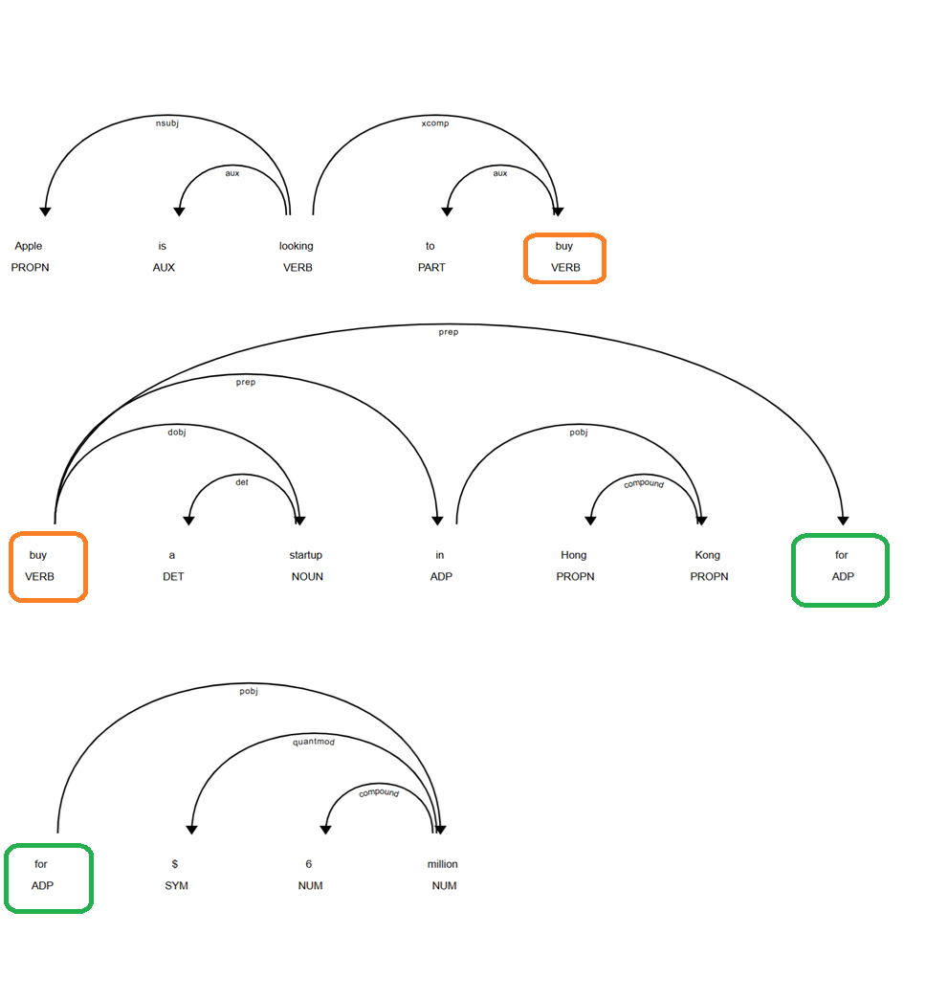
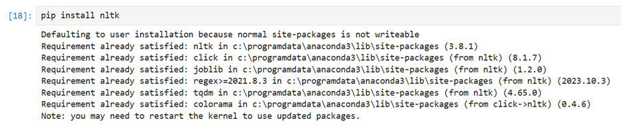

# ניתוח טקסט עם SpaCy – פונקציונליות בסיסית המשך

## Noun Chunks, displaCy, and Visualization in SpaCy

## 🧠 מה זה Noun Chunk?

### Noun Chunk (צירוף שמני)

השורש ש־ם־ע או ליתר דיוק מהמילה שֵׁם — במשמעות שם עצם

צירוף שמני הוא רצף מילים שמכיל ⭐שם עצם⭐ (או כנוי גוף) יחד עם תארים, מילות יחס או קבעים שמתארים אותו.

#### דוגמא:
> "The quick brown fox" ← צרוף שמני אחד

## כיצד SpaCy מזהה אותם?

המודל מזהה באופן אוטומטי צירופים שמניים בכל משפט בטקסט, ומציע להם גישה עם `noun_chunks`

```python
import spacy
nlp = spacy.load("en_core_web_sm")
doc = nlp("The quick brown fox jumps over the lazy dog.")

for chunk in doc.noun_chunks:
    print(chunk.text)
```

#### Output:
```
The quick brown fox
the lazy dog
```

## למה זה שימוש?

Noun Chunks represent meaningful content units that reflect the main entities and owners in the sentence

Recognizing them helps identify the core structure and focus of the text

### Uses of Noun Chunks:
- **Information Retrieval** → Isolate and extract relevant information from text  
- **Text Summarization** → Identify the most informative parts of a sentence  
- **Semantic NLP Tasks** → Useful in tasks involving deeper understanding of meaning and relationships in text

## ה- 🎨 displaCy – ויזואליזציה גרפית

ספייסי מציעה את displaCy ככלי שמזהה בסביבת ההפעלה את המבנה הגרמטי של המשפט ואת הישויות בשם  
המונח "מבנה דקדוקי" (או: מבנה גרמטיקלי) במשפט מתאר את האופן שבו המילים מקושרות זו לזו מבחינה תחבירית – כלומר, מי הנושא, מהו הפועל, מי המושא, איך מילת יחס מתחברת לשאר המשפט, ועוד

### שינוי displaCy:
- **Dependency Parsing** → מציג את הקשר בין המילים
- **Named Entity Recognition (NER)** → מציג את הישויות השם

### לדוגמא:
```python
from spacy import displacy
import spacy

nlp = spacy.load("en_core_web_sm")
doc = nlp("Apple is looking to buy a startup in Hong Kong for $6 million")

displacy.render(doc, style="dep", jupyter=True)  # להציג תחביר

displacy.render(doc, style="ent", jupyter=True)  # להציג ישויות בשם
```




```python
doc = nlp('Over the last quarter Apple sold nearly 20 thousand iPods for a profit of $6 million.')
displacy.render(doc, style='ent', jupyter=True)
```


### סיכום:

* `noun_chunks` returns noun phrases automatically from the text
* `displaCy` offers visual representation of key linguistic elements in the sentence
* Understanding and using these tools helps you analyze both the structure and content of text effectively

## ה- Stemming – מה זה ולמה זה חשוב

ה- Stemming היא טכניקת קדם-עיבוד בתחום עיבוד שפה טבעית (NLP)

המטרה של stemming היא להחזיר מילים לצורת השורש שלהן כדי שמילים עם אותה משמעות בסיסית ייחשבו לשוות

לדוגמה:

* "running", "runner", "ran" → כולם מחזירים את השורש: "run"
* "fairness", "fairly" → לשתיהן השורש: "fair"

### למה להשתמש ב־Stemming

* מקטין וריאציות של מילים לצורה בסיסית אחת
* תורם להתאמה טובה יותר בין מסמכים ושאילתות בחיפוש מידע
* מקטין את מספר המילים הייחודיות בטקסט

### אלגוריתמים נפוצים

* **Porter Stemmer** – נפוץ מאוד באנגלית, משתמש בחוקים קבועים לקיצוץ סיומות
* **Snowball Stemmer** – גרסה מתקדמת יותר של פורטר, תומכת במספר שפות

### שימו לב

ה- spaCy לא כוללת stemmer מובנה
כדי להשתמש ב־stemming, צריך לייבא אותו מספרייה חיצונית כמו NLTK

```python
pip install nltk
```



### דוגמה בקוד

```python
import nltk
from nltk.stem import PorterStemmer, SnowballStemmer

stemmer = PorterStemmer()
words = ['run','runner','running','ran','runs','easily','fairly','fairness']
for word in words:
    print(word, "→", stemmer.stem(word))
```

Output:

```
run → run
runner → runner
running → run
ran → ran
runs → run
easily → easili
fairly → fairli  # wrong לא מילה תקנית באנגלית
fairness → fair
```

### דוגמה עם Snowball

```python
import nltk
from nltk.stem import PorterStemmer, SnowballStemmer

s_stemmer = SnowballStemmer(language='english')

words = ['run','runner','running','ran','runs','easily','fairly','fairness']

for word in words:
    print(word+' --> '+s_stemmer.stem(word))
```

Output:
```
run --> run
runner --> runner
running --> run
ran --> ran
runs --> run
easily --> easili # wrong
fairly --> fair  # correct 
fairness --> fair
```

ה- Snowball החזיר "fair" ולא "fairli" כמו האלגוריתם של Porter

הסיבה שה־Porter Stemmer מחזיר `fairli` וה־Snowball Stemmer מחזיר `fair` נובעת מהשוני בחוקים של שני האלגוריתמים:

#### למה Porter מחזיר `fairli`

ה- Porter Stemmer פשוט מקצר סיומות לפי כללים קבועים בלי להבין את משמעות המילה
במקרה של `fairly`, הוא מוריד רק את `-ly` אבל לא ממשיך הלאה ולכן נשאר עם `fairli` – שהוא לא באמת מילה נכונה

#### למה Snowball מחזיר `fair`

ה- Snowball Stemmer הוא גרסה חכמה יותר
הוא לוקח בחשבון הקשר לשוני רחב יותר 

ומכיל חוקים מורחבים שמזהים גם קונסטרוקציות נפוצות כמו `-ly`

לכן הוא יודע לחתוך את הסיומת נכון ולהחזיר את השורש `fair` שהוא באמת מובן ושימושי

#### למה Snowball מחזיר `easili` ולא `easy`

גם Snowball, למרות שהוא חכם יותר מ־Porter, עדיין מבוסס על כללים ולא מבין את המשמעות המלאה של המילה
הוא מזהה שסיום `-ly` נפוץ ולכן חותך אותו
אבל אחרי החיתוך הוא לא מצליח להחזיר את הצורה התקנית `easy` אלא עוצר ב־`easili`, כי:

* האלגוריתם לא מבצע תיקון אורתוגרפי (spelling correction)
* אין לו גישה למילון או כלים להבין שמדובר בשורש `easy`

#### האם `easili` היא טעות

כן — מבחינת אנגלית תקנית, `easili` אינה מילה קיימת
Snowball עשה חיתוך נכון חלקית, אבל לא מושלם

#### מה הפתרון

אם חשוב לך לקבל מילים תקניות אמיתיות, כדאי להשתמש ב־Lemmatization במקום Stemming
Lemmatization משתמשת בדקדוק ומילון כדי להחזיר צורה נכונה כמו `easy`


### סיכום

ה- Stemming הוא כלי פשוט אך חשוב בהכנת טקסט לניתוח
במקום לעבוד עם כל מילה כמו שהיא, אנחנו מצמצמים את כולן לצורה אחידה כדי להבין את המשמעות המרכזית
