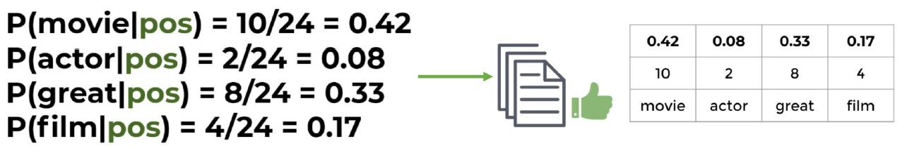
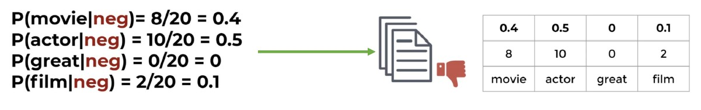

# דוגמה פשוטה: Naive Bayes ב־NLP

## שלב 1: הגדרת הבעיה


יש לנו 35 ביקורות סרטים.  
כל ביקורת כוללת טקסט ואת הסיווג שלה: חיובית או שלילית

המטרה: לאמן מודל Naive Bayes שיוכל לחזות אם ביקורת חדשה היא חיובית או שלילית

## שלב 2: חישוב הסתברויות בסיסיות (Prior)

מתוך 35 ביקורות:

- 25 חיוביות  
- 10 שליליות  

לכן:

- P(positive reviews) = 25 / 35  
- P(negative reviews) = 10 / 35  


## שלב 3: ספירת מילים בכל קטגוריה

אנחנו מבצעים Count Vectorization — סופרים כמה פעמים כל מילה הופיעה בכל קטגוריה

**חיובי**:

| מילה   | מופעים |
|--------|--------|
| movie  | 10     |
| actor  | 2      |
| great  | 8      |
| film   | 4      |

**סה״כ מילים בקטגוריה חיובית: 24**


קטגוריה חיובית:

- P(movie | positive) = 10 / 24 = 0.42  
- P(actor | positive) = 2 / 24 = 0.08  
- P(great | positive) = 8 / 24 = 0.33  
- P(film | positive) = 4 / 24 = 0.17



**שלילי**:

| מילה   | מופעים |
|--------|--------|
| movie  | 8      |
| actor  | 10     |
| great  | 0      |
| film   | 2      |

**סה״כ מילים בקטגוריה שלילית: 20**

קטגוריה שלילית:

- P(movie | negative) = 8 / 20 = 0.4  
- P(actor | negative) = 10 / 20 = 0.5  
- P(great | negative) = 0 / 20 = 0  
- P(film | negative) = 2 / 20 = 0.1



## שלב 4: חיזוי טקסט חדש: "movie actor"

$$
P(C_k | \mathbf{x}) \propto P(C_k) \cdot \prod_{i=1}^{n} P(x_i | C_k)
$$

- x = ["movie", "actor"] tokens
  
  זהו וקטור המאפיינים : רשימת המילים שבביקורת 

- C = ["positive", "negative"]

  אלו המחלקות האפשריות (labels)

  אנחנו רוצים לגלות לאיזו מחלקה הטקסט איקס הכי מתאים

- **P(Cₖ)** = ההסתברות המוקדמת של כל מחלקה  → כלומר

  Pc1 = P(positive reviews) = 25/35

  Pc2 = P(negative reviews) = 10/35

### עבור "positive":

 - P("movie" | positive), P("actor" | positive) → see previous section table

```
P(positive reviews) * P("movie" | positive) * P("actor" | positive)
= (25/35) * (0.42) * (0.08) = 0.024
```

### עבור "negative":

- P("movie" | negative), P("actor" | negative) → see previous section table

```
P(negative reviews) * P("movie" | negative) * P("actor" | negative)
= (10/35) * (0.4) * (0.5) = 0.057
```

🟢 לכן התוצאה הסופית היא: **Negative**

🖼️ **הוספת תמונה**: ADD IMAGE HERE FROM PAGE 13

## שלב 5: בעיית אפס הסתברות

ניקח טקסט חדש: `"great movie"`


**אם נחשב עבור negative:**

P(negative reviews) = 10/35

```
P(negative reviews) * P(great | negative) * P(movie | negative)
= (10 / 35) * 0 * 0.4 = 0
```

למה? כי המילה "great" לא הופיעה בכלל בביקורות שליליות → הסתברות = 0

**למה זאת בעיה?**

אם **אחת ההסתברויות שווה ל-0**, כל המכפלה תהיה **0**,  
וזה יגרום לכך שהמודל יפסול את המחלקה לחלוטין — גם אם כל שאר המילים כן מתאימות לה

P("movie" | negative) = 0.4

P("actor" | negative) = 0.5

P("great" | negative) = 0

P(negative | "great movie actor") = P(negative reviews) * 0.4 * 0.5 * 0 = 0

**פתרון: Alpha Smoothing**

נוסיף ערך קטן (למשל 1) לכל ספירת מילה, כדי למנוע אפס

P("great" | negative) = 0 / 20 = 0 ❌

P("great" | negative) = (0 + 1) / (20 + V) ≈ 0.0417✅

- 20 = סך כל מופעי המילים במחלקת negative  
- V = מספר המילים הייחודיות הכולל בדאטה (positive + negative)

V = מספר מילים ייחודיות = 4
["movie", "actor", "great", "film"]