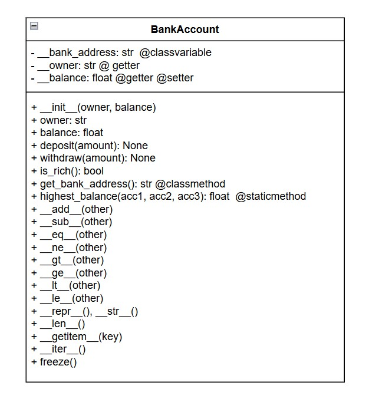

## 🏦 Exercise: `BankAccount` Class 



Create a class named `BankAccount` that represents a simple bank account with:

- `owner`: the name of the account holder (string)
- `balance`: how much money is in the account (float)

### 1. Constructor
```python
def __init__(self, owner: str, balance: float)
```

### 2. Class Variable and Class Method

- Add a **private class variable** for the bank's address:  
  `"1 Allenby St, Tel Aviv"` (actual Discount Bank branch)

- Add a **class method**:
  ```python
  @classmethod
  def get_bank_address(cls) -> str
  ```
  Returns the bank address.

### 3. Static Method

Add a static method:
```python
@staticmethod
def highest_balance(acc1: "BankAccount", acc2: "BankAccount", acc3: "BankAccount") -> float
```

- Return the highest balance among the three accounts.
- No use of `self` or `cls` — it’s a utility.

Example:
```python
a1 = BankAccount("A", 300)
a2 = BankAccount("B", 700)
a3 = BankAccount("C", 500)
print(BankAccount.highest_balance(a1, a2, a3))  # → 700.0
```

### 4. Properties (Getters and Setters)

Use `@property` to create:

- `owner` – read-only
- `balance` – readable and writeable

### 5. Methods

- `deposit(self, amount: float) -> None`
- `withdraw(self, amount: float) -> None`
- `is_rich(self) -> bool`

### 6. Operator Overloading

- `__add__(self, other)`  
  - Add two accounts → if owners differ, return `"Joint: A & B"`  
  - Add number → return new account with increased balance

- `__sub__(self, other)`  
  - Subtract another account or number → return new account

- `__eq__(self, other)`  
  - Compare owner and balance  
  - Also support comparing with a number or tuple

- `__ne__`, `__gt__`, `__ge__`, `__lt__`, `__le__` → compare balance only

- `__repr__`, `__str__`  
- `__len__()` → rounded balance  
- `__getitem__(key)` → 'owner', 'balance', 0, 1  
- `__iter__()` → yields owner, balance

### 7. Bonus Feature 💡

```python
def freeze(self) -> None
```
Sets:
- `owner = "FROZEN"`
- `balance = 0.0`

### 8. Demo Code

Test all features, including:
```python
print(BankAccount.get_bank_address())
print(BankAccount.highest_balance(a1, a2, a3))
```

---

### 📦 UML: BankAccount

```
|-----------------------------|
|        BankAccount          |
|-----------------------------|
| - __bank_address: str       |
| - __owner: str              |
| - __balance: float          |
|-----------------------------|
| + __init__(owner, balance) |
| + owner: str                |
| + balance: float            |
| + deposit(amount): None     |
| + withdraw(amount): None    |
| + is_rich(): bool           |
| + get_bank_address(): str   |
| + highest_balance(acc1, acc2, acc3): float |
| + __add__(other)            |
| + __sub__(other)            |
| + __eq__(other)             |
| + __ne__(other)             |
| + __gt__(other)             |
| + __ge__(other)             |
| + __lt__(other)             |
| + __le__(other)             |
| + __repr__(), __str__()     |
| + __len__()                 |
| + __getitem__(key)          |
| + __iter__()                |
| + freeze()                  |
|-----------------------------|
```
